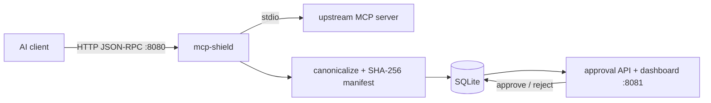

<p align="center">
  
</p>

> A Zero Trust gateway for the Model Context Protocol. Every tool an MCP
> server advertises is fingerprinted, diffed, and held for human approval
> before an AI client can see or call it.

[](https://github.com/EricMarcantonio/mcp-shield/actions/workflows/ci.yml)
[](https://goreportcard.com/report/github.com/EricMarcantonio/mcp-shield)
[](https://pkg.go.dev/github.com/EricMarcantonio/mcp-shield)
[](LICENSE)

## Quickstart

> [!NOTE]
> **Not live yet.** `v0.1.0` hasn't been tagged, and this repository is
> still private, so `go install` and `docker pull` below 404 today. The
> commands are the real, permanent instructions — they start working the
> moment the tag ships **and** the repo is public **and** (separately —
> package visibility doesn't follow repo visibility) the ghcr package is
> flipped to public. Until then, use "Build from source right now" below.

### 1. Install (pick one)

```sh
# go install
go install github.com/EricMarcantonio/mcp-shield/cmd/mcp-shield@latest

# ...or download a release archive (linux/darwin/windows x amd64/arm64) from
# https://github.com/EricMarcantonio/mcp-shield/releases and put the
# `mcp-shield` binary on your $PATH.

# ...or Docker
docker pull ghcr.io/ericmarcantonio/mcp-shield:latest
```

### 2. Configure and run

```sh
mkdir -p config data
cat > config/servers.json <<'EOF'
[
  {"name": "my-server", "command": "/path/to/your/mcp-server", "args": []}
]
EOF

mcp-shield
```

...or with Docker:

```sh
docker run -p 8080:8080 -p 8081:8081 \
  -v "$(pwd)/config:/config:ro" -v "$(pwd)/data:/data" \
  -e CONFIG_PATH=/config/servers.json -e DATABASE_PATH=/data/mcp.db \
  ghcr.io/ericmarcantonio/mcp-shield:latest
```

### 3. Approve the first connection

Point an MCP-capable HTTP client at `http://localhost:8080/mcp/my-server`,
or wire up a stdio client such as Claude Desktop with `mcp-shield connect`
(see [Client compatibility](#client-compatibility)). First connection
creates a PENDING manifest; since there's no
approved baseline yet, `tools/list` comes back empty and any `tools/call`
is blocked, until you review and approve it:

```sh
curl localhost:8081/api/manifests/pending
curl -X POST localhost:8081/api/manifests/1/approve -d '{"username":"you","reason":"reviewed"}'
```

...or use the dashboard at `http://localhost:8081/`. The dashboard needs
`web/dashboard/templates` on disk (`TEMPLATES_DIR`, default
`web/dashboard/templates`, resolved relative to the working directory);
release archives and the Docker image bundle it automatically, `go
install` does not — with only `go install`, run `mcp-shield` from a
directory containing that path, or set `TEMPLATES_DIR` explicitly, or
skip the dashboard and use the JSON API and CLI above, which don't need it.

> **Deployment warning:** the approval API/dashboard (`:8081`) has no
> authentication. Bind it to localhost or a trusted network only — see
> [SECURITY.md](SECURITY.md).

### Build from source, right now

The paths above aren't live yet (see the note above), but the gateway
itself is fully working — this is the one that actually runs today:

```sh
git clone https://github.com/EricMarcantonio/mcp-shield.git
cd mcp-shield
make build   # -> bin/mcp-shield, bin/mcp-shield-testserver
cp config/servers.example.json config/servers.json  # edit command/args for your real MCP server
./bin/mcp-shield
```

...or via Docker Compose, which builds the image locally instead of
pulling it:

```sh
cp config/servers.example.json config/servers.json
make docker-build
make docker-up
```

Then continue from step 3 above. For a guided walkthrough that edits a
running server's tools and watches the gate react in real time, see
[docs/manual-testing.md](docs/manual-testing.md).

## What it does, and why

An MCP server can change what it offers at any time — a compromised or
updated upstream server could silently add a `delete_*`, `upload_*`, or
`execute_*` tool and start receiving calls from a trusted AI client with no
warning. mcp-shield closes that gap: every connection is fingerprinted into
a canonical manifest and diffed against the last approved version. New or
changed capabilities are withheld until a human approves them — but
withholding is scoped to what actually changed, not the whole server: tools
that are byte-identical to the last approved version keep working even
while a new or modified tool sits pending or gets rejected. A rejected
change never brings down the tools you already trusted.



- **Client-facing (`:8080`)**: `POST /mcp/{server}`, one JSON-RPC request
  per HTTP call.
- **Upstream-facing**: stdio subprocess — mcp-shield spawns the real MCP
  server and speaks JSON-RPC over its stdin/stdout.
- **Every** intercepted call (`initialize`, `tools/list`, `prompts/list`,
  `resources/list`, `tools/call`) re-fetches the upstream server's current
  capabilities and re-runs the gate before anything is forwarded to the
  client — there's no "already approved this session" shortcut a server
  could exploit by changing behavior mid-session.

Full gate semantics — the exact partial-allow rules, and the structural
guarantees behind manifest immutability and fail-closed behavior — are in
[docs/security-model.md](docs/security-model.md).

## Configuration

| Env var | Default | Purpose |
|---|---|---|
| `CONFIG_PATH` | `config/servers.json` | Upstream server definitions (command/args/env) |
| `DATABASE_PATH` | `data/mcp.db` | SQLite location |
| `PROXY_ADDR` | `:8080` | Client-facing listener |
| `API_ADDR` | `:8081` | Approval API + dashboard listener |
| `FAIL_MODE` | `block` | `block` (fail closed) or `warn` (observe only, never for production) |
| `TEMPLATES_DIR` | `web/dashboard/templates` | Dashboard templates |
| `NOTIFY_CONFIG_PATH` | `config/notify.json` | Webhook notification config; missing file disables notifications |
| `MCP_SHIELD_API` | `http://localhost:8081` | Target API for the `mcp-shield` CLI |

## Notifications

The gate fails closed, so a withheld capability is invisible until someone
looks at the dashboard. Configure webhook targets in `config/notify.json`
(copy `config/notify.example.json`) and mcp-shield POSTs an HMAC-signed JSON
event whenever it records a new pending manifest. Slack and Discord work via
`"format": "slack"`. Delivery is at-least-once with persisted backoff, and
events that were never delivered stay visible at
`GET /api/notifications/failed`. Nothing on this path can block or delay a
gate decision.

See [docs/notifications.md](docs/notifications.md) for the payload schema,
the signature-verification snippets, and the retry schedule.

## CLI

```sh
mcp-shield servers
mcp-shield manifests
mcp-shield approve <id>
mcp-shield reject <id>
mcp-shield diff <id>
```

Talks to `$MCP_SHIELD_API` (default `http://localhost:8081`).

`cmd/mcp-shield-testserver` is a fake MCP server with three tool sets, used
for manual and automated testing of the approval pipeline — see
[docs/manual-testing.md](docs/manual-testing.md):

- `-version v1`: `calendar_read`, `calendar_create`
- `-version v2`: adds `upload_attachment`
- `-version v3`: adds `delete_calendar`, `execute_command`

## Client compatibility

Works today, two ways:

- Any client that can send a JSON-RPC request as an HTTP POST to
  `/mcp/{server}`. This is not yet the spec's Streamable HTTP transport,
  just a plain HTTP wrapper.
- Any client that spawns a subprocess and speaks newline-delimited
  JSON-RPC over its stdin/stdout — Claude Desktop's classic config, among
  others — via `mcp-shield connect`, below.

### Claude Desktop (stdio) — `mcp-shield connect`

Claude Desktop launches an MCP server as a subprocess; it cannot point at
an HTTP endpoint. `mcp-shield connect <server>` is that subprocess: it
reads JSON-RPC frames from stdin, forwards each one as a
`POST {gateway}/mcp/{server}`, and writes the responses to stdout.

Start the gateway as usual, then add this to
`~/Library/Application Support/Claude/claude_desktop_config.json`
(macOS) or `%APPDATA%\Claude\claude_desktop_config.json` (Windows), where
`calendar` matches a `name` in your `config/servers.json`:

```json
{
  "mcpServers": {
    "calendar": {
      "command": "/usr/local/bin/mcp-shield",
      "args": ["connect", "calendar", "--gateway", "http://localhost:8080"]
    }
  }
}
```

Use an absolute `command` path — Claude Desktop does not inherit your
shell's `PATH`. If you installed with `go install`, that path is usually
`~/go/bin/mcp-shield`. `--gateway` may be omitted (it defaults to
`http://localhost:8080`, overridable with the `MCP_SHIELD_PROXY`
environment variable). Restart Claude Desktop after editing the file.

The first connection creates a PENDING manifest, so `calendar` will show
up with no tools until you approve it — see
[Approve the first connection](#3-approve-the-first-connection). Approve,
then start a new chat; the tools appear.

**What this does and does not do.** Requests are forwarded concurrently
(clients pipeline them) and each response is written as one whole frame,
so ordering and interleaving are handled. But it is still **one JSON-RPC
request per HTTP call** — there is no persistent stream, no batching, and
no session state in the shim. And there are **no server-initiated
notifications**: nothing reaches the client that the client did not ask
for, so `notifications/tools/list_changed` and friends never arrive. That
is deliberate rather than missing. The gateway re-fetches and re-gates the
upstream's full capability set on *every* call, so a changed tool list is
caught at the next request without anyone needing to push about it; a
`listChanged` shortcut would be a cache the gate exists to avoid.

Frames are capped at 8 MiB in each direction, matching the upstream stdio
transport. A larger frame is refused with a JSON-RPC error rather than
truncated. Failures — gateway unreachable, a non-2xx status, a body that
is not JSON-RPC — come back as a JSON-RPC error naming the cause; all
human-readable diagnostics go to stderr, because stdout is the protocol
channel.

Native Streamable HTTP (which would let spec-conformant clients connect
without the shim, and let the gateway proxy *remote* MCP servers) is
sequenced next — decision D3 in
[the design doc](docs/superpowers/specs/2026-07-25-oss-hardening-design.md#design-question-b--upstream--transport-strategy-decision-d3).

## Development

```sh
make build            # bin/mcp-shield, bin/mcp-shield-testserver
make test-unit
make test-integration  # requires `make build` first
make test              # both
make lint              # golangci-lint
```

See [CONTRIBUTING.md](CONTRIBUTING.md) for setup, ground rules, and PR
expectations.

## Versioning & stability

SemVer, currently 0.x: interfaces may change between minor versions
without notice.

## Explicitly out of scope for this MVP

Kubernetes deployment, a distributed database, advanced sandboxing, eBPF,
runtime syscall monitoring, and notifications (planned, not built — see
[decision D2 in the design doc](docs/superpowers/specs/2026-07-25-oss-hardening-design.md#design-question-a--notifications-decision-d2)).
Left as seams for later, not built:
- `database.Store` is an interface — a Postgres backend can implement it
  without touching `approval`/`api`/`mcp`.
- `mcp.Transport` is an interface — a Streamable HTTP transport can be
  added without touching `UpstreamClient`, which is what would let the
  gateway proxy *remote* MCP servers rather than only local subprocesses.
- `manifest.Hash()` output is a plain hex SHA256 string a future
  Sigstore/cosign signing step could wrap.
- OAuth, network policy enforcement, and runtime sandboxing are not
  addressed; `config/servers.json`'s per-server `env` is the noted future
  hook for secrets-manager-backed credential injection instead of plaintext.

## Security

See [SECURITY.md](SECURITY.md) for the vulnerability reporting process and
what counts as a security bug here.

## License

Apache-2.0 — see [LICENSE](LICENSE).
