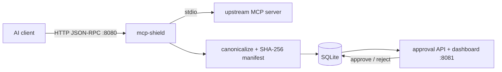

<p align="center">
  
</p>

> A Zero Trust gateway for the Model Context Protocol. Every tool an MCP
> server advertises is fingerprinted, diffed, and held for human approval
> before an AI client can see or call it.

[](https://github.com/EricMarcantonio/mcp-shield/actions/workflows/ci.yml)
[](https://goreportcard.com/report/github.com/EricMarcantonio/mcp-shield)
[](https://pkg.go.dev/github.com/EricMarcantonio/mcp-shield)
[](LICENSE)

## Why

An MCP server can change what it offers at any time — a compromised or
updated upstream server could silently add a `delete_*`, `upload_*`, or
`execute_*` tool and start receiving calls from a trusted AI client with no
warning. mcp-shield closes that gap: every connection is fingerprinted into
a canonical manifest, diffed against the last approved version, risk
classified, and gated. New or changed capabilities are withheld until a
human approves them — but withholding is scoped to what actually changed,
not the whole server: tools that are byte-identical to the last approved
version keep working even while a new or modified tool sits pending or
gets rejected. A rejected change never brings down the tools you already
trusted.

## How it works



- **Client-facing (`:8080`)**: `POST /mcp/{server}`, one JSON-RPC request
  per HTTP call.
- **Upstream-facing**: stdio subprocess — mcp-shield spawns the real MCP
  server and speaks JSON-RPC over its stdin/stdout.
- **Every** intercepted call (`initialize`, `tools/list`, `prompts/list`,
  `resources/list`, `tools/call`) re-fetches the upstream server's current
  capabilities and re-runs the gate before anything is forwarded to the
  client — there's no "already approved this session" shortcut a server
  could exploit by changing behavior mid-session.

Full gate semantics, the structural guarantees behind manifest immutability
and fail-closed behavior, and the risk-classification rules are in
[docs/security-model.md](docs/security-model.md).

## Install

There are no tagged releases yet, so source is the only path today:

```sh
git clone https://github.com/EricMarcantonio/mcp-shield.git
cd mcp-shield
make build   # -> bin/mcp-shield, bin/mcp-shield-testserver
```

Once the first tag (`v0.1.0`) is pushed, `.github/workflows/release.yml`
(GoReleaser) will publish, for every `vX.Y.Z` tag:

- Cross-compiled `mcp-shield` archives for linux/darwin/windows ×
  amd64/arm64, plus checksums, attached to a GitHub Release.
- A multi-arch (amd64+arm64) Docker image at
  `ghcr.io/ericmarcantonio/mcp-shield:X.Y.Z` (and `:latest`).

**Neither of those is usable yet, and this section will keep saying so
until both conditions below are true — do not treat the commands below as
currently working:**

```sh
# Will work once the repo is public AND a tag has shipped. Today it 404s.
go install github.com/EricMarcantonio/mcp-shield/cmd/mcp-shield@latest

# Will work once the repo is public, a tag has shipped, AND the ghcr
# package's own visibility has been separately flipped to public (package
# visibility does not follow repo visibility automatically). Today: no tag,
# no public package — this will fail.
docker pull ghcr.io/ericmarcantonio/mcp-shield:latest
```

This repository is currently **private**. That alone blocks anonymous
`go install`, blocks anonymous `docker pull` against ghcr, and is why the
badges at the top of this file won't render for anyone without repo
access. None of that is a release-engineering bug — it's a consequence of
visibility, and it resolves the moment the repo (and separately, the ghcr
package) go public.

## Quickstart (Docker)

```sh
cp config/servers.example.json config/servers.json  # edit command/args for your real MCP server
make docker-build
make docker-up
```

Point an MCP-capable HTTP client at `http://localhost:8080/mcp/<name>`
(the `name` from `config/servers.json`). First connection creates a
PENDING manifest; since there's no approved baseline yet, `tools/list`
comes back empty and any `tools/call` is blocked. Review and approve it:

```sh
curl localhost:8081/api/manifests/pending
curl -X POST localhost:8081/api/manifests/1/approve -d '{"username":"you","reason":"reviewed"}'
```

...or use the dashboard at `http://localhost:8081/`.

For a guided walkthrough that edits a running server's tools and watches
the gate react in real time, see
[docs/manual-testing.md](docs/manual-testing.md).

## Configuration

| Env var | Default | Purpose |
|---|---|---|
| `CONFIG_PATH` | `config/servers.json` | Upstream server definitions (command/args/env) |
| `DATABASE_PATH` | `data/mcp.db` | SQLite location |
| `PROXY_ADDR` | `:8080` | Client-facing listener |
| `API_ADDR` | `:8081` | Approval API + dashboard listener |
| `FAIL_MODE` | `block` | `block` (fail closed) or `warn` (observe only, never for production) |
| `TEMPLATES_DIR` | `web/dashboard/templates` | Dashboard templates |
| `MCP_SHIELD_API` | `http://localhost:8081` | Target API for the `mcp-shield` CLI |

> **Deployment warning:** the approval API/dashboard (`:8081`) has no
> authentication. Bind it to localhost or a trusted network only — see
> [SECURITY.md](SECURITY.md).

## Risk classification

Every diff against the last approved manifest is classified HIGH (a new
tool's name matches a blunt, intentional substring list —
`delete`/`upload`/`execute`/`shell`/`file`/`write`/`admin`/`credential` —
false positives like `filesystem_status` are expected; a human makes the
final call), MEDIUM (a tool's input schema changed), or LOW (description-only
or no risk-relevant change). Full precedence rules:
[docs/security-model.md](docs/security-model.md#risk-classification).

## CLI

```sh
mcp-shield servers
mcp-shield manifests
mcp-shield approve <id>
mcp-shield reject <id>
mcp-shield diff <id>
```

Talks to `$MCP_SHIELD_API` (default `http://localhost:8081`).

## Client compatibility

Works today: any client that can send a JSON-RPC request as an HTTP POST
to `/mcp/{server}` — this is not yet the spec's Streamable HTTP transport,
just a plain HTTP wrapper.

Not yet supported: Claude Desktop's classic stdio-spawned-server config,
or any other client that only knows how to launch a subprocess and speak
JSON-RPC over its stdin/stdout. A stdio shim to bridge that case is a
documented future-extension seam (`internal/mcp.Transport`) and an open
design question — transport strategy, decision D3 in
[the design doc](docs/superpowers/specs/2026-07-25-oss-hardening-design.md#design-question-b--upstream--transport-strategy-decision-d3)
— it is **not built** in the current version. There is no
`mcp-shield connect` command.

## Development

```sh
make build            # bin/mcp-shield, bin/mcp-shield-testserver
make test-unit
make test-integration  # requires `make build` first
make test              # both
make lint               # golangci-lint
```

`cmd/mcp-shield-testserver` is a fake MCP server with three tool sets, used
for manual and automated testing of the approval pipeline:

- `-version v1`: `calendar_read`, `calendar_create` (LOW risk)
- `-version v2`: adds `upload_attachment` (HIGH risk — matches "upload")
- `-version v3`: adds `delete_calendar`, `execute_command` (HIGH risk)

See [CONTRIBUTING.md](CONTRIBUTING.md) for setup, ground rules, and PR
expectations.

## Versioning & stability

SemVer, currently 0.x: interfaces may change between minor versions
without notice.

## Explicitly out of scope for this MVP

Kubernetes deployment, a distributed database, advanced sandboxing, eBPF,
runtime syscall monitoring, notifications (planned, not built — see
[decision D2 in the design doc](docs/superpowers/specs/2026-07-25-oss-hardening-design.md#design-question-a--notifications-decision-d2)),
and the stdio shim mentioned above. Left as seams for later, not built:
- `database.Store` is an interface — a Postgres backend can implement it
  without touching `approval`/`api`/`mcp`.
- `mcp.Transport` is an interface — an HTTP/SSE transport or a
  Claude-Desktop stdio shim can be added without touching `UpstreamClient`.
- `manifest.Hash()` output is a plain hex SHA256 string a future
  Sigstore/cosign signing step could wrap.
- OAuth, network policy enforcement, and runtime sandboxing are not
  addressed; `config/servers.json`'s per-server `env` is the noted future
  hook for secrets-manager-backed credential injection instead of plaintext.

## Security

See [SECURITY.md](SECURITY.md) for the vulnerability reporting process and
what counts as a security bug here.

## License

Apache-2.0 — see [LICENSE](LICENSE).
