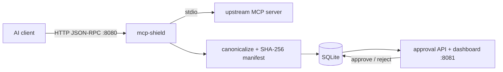

# mcp-shield OSS Hardening Implementation Plan

> **For agentic workers:** REQUIRED SUB-SKILL: Use superpowers:subagent-driven-development (recommended) or superpowers:executing-plans to implement this plan task-by-task. Steps use checkbox (`- [ ]`) syntax for tracking.

**Goal:** Turn the mcp-shield MVP into a professional open-source project: real linting, real tests (including fuzzing the security-critical canonicalizer), CI/CD with cross-platform releases, complete repository hygiene, targeted clean-code refactors, and a newcomer-ready README — merged incrementally, every phase ending green.

**Architecture:** No architectural rewrites. The existing `cmd/` + `internal/` layout and package boundaries stay. Work is sequenced: hygiene files → tooling → CI → tests (safety net) → refactors → docs/renames → releases → (user-gated) notifications and transports.

**Tech Stack:** Go 1.25+, modernc.org/sqlite (only runtime dep), golangci-lint v2, govulncheck, native Go fuzzing, GitHub Actions, GoReleaser, ghcr.io.

**Design doc:** `docs/superpowers/specs/2026-07-25-oss-hardening-design.md` — read its "Decisions needed from you" table first. Phases 1, 4, 7, 8, 9 have gated items (D1–D6).

## Global Constraints

- Module path stays `github.com/EricMarcantonio/mcp-shield`. No `pkg/` directory is created.
- **Gate semantics must not change**: partial-allow behavior, fail-closed default, risk keyword list, and manifest immutability are all frozen. Any task that touches `internal/approval`, `internal/diff`, or `internal/mcp` must leave `go test ./...` and `go test -tags=integration ./test/...` passing with unmodified assertions (except where a task explicitly adds assertions).
- No new runtime dependencies in Phases 1–8. (`golangci-lint`, `govulncheck`, `goreleaser` are tool-side only and must not enter `go.mod`.)
- Every phase ends with: `make lint && make test` green (after Phase 2 defines those targets; before that, `gofmt -l .` empty, `go vet ./...` and `go test ./...` green).
- Each phase is a separate branch off `main`, merged when green: `chore/p1-hygiene`, `chore/p2-tooling`, `ci/p3-workflows`, `test/p4-coverage`, `refactor/p5-clean-code`, `docs/p6-readme`, `build/p7-release`, `feat/p8-notifications`, `feat/p9-stdio-shim`.
- Commit messages: imperative subject, no enforced convention. One commit per task unless a task says otherwise.
- Baseline (verified 2026-07-25 on 87d99cd): all tests green; coverage approval 78.4% / manifest 72.0% / diff 63.7% / database 58.0% / api 37.3% / mcp 0% / app 0%.

---

# Phase 1 — Repository hygiene (0.5 day) [GATED on D1 for Task 1 only]

No Go code changes. Trivially green.

### Task 1: LICENSE

**Files:** Create: `LICENSE`

- [ ] **Step 1:** Confirm decision D1 (recommended: Apache-2.0). If unconfirmed, STOP this task, do the rest of Phase 1, and return here.
- [ ] **Step 2:** Fetch the canonical text (do not paraphrase a license):
```bash
curl -fsSL https://www.apache.org/licenses/LICENSE-2.0.txt -o LICENSE
```
- [ ] **Step 3:** Verify: `head -2 LICENSE` shows "Apache License" / "Version 2.0, January 2004". Do NOT fill in the appendix boilerplate fields; the file is used verbatim.
- [ ] **Step 4:** Commit: `git add LICENSE && git commit -m "Add Apache-2.0 license"`

### Task 2: SECURITY.md

**Files:** Create: `SECURITY.md`

- [ ] **Step 1:** Create `SECURITY.md` with exactly this content:

```markdown
# Security Policy

mcp-shield is a security control. Bugs in it are security bugs. Please report
them privately.

## Reporting a vulnerability

Use GitHub's private vulnerability reporting:
**https://github.com/EricMarcantonio/mcp-shield/security/advisories/new**

Do not open a public issue for anything you believe is exploitable.

You can expect an acknowledgment within 7 days. We follow a 90-day coordinated
disclosure window: we will work with you on a fix and credit you in the
advisory unless you prefer otherwise.

## What counts as a vulnerability here

Anything that breaks the gate's stated guarantees, including:

- **Gate bypass** — any way for a tool/prompt/resource that is not in the
  approved baseline to be listed to a client or invoked upstream while
  `FAIL_MODE=block`.
- **Canonicalization instability** — two semantically identical capability
  sets producing different hashes, or two different capability sets
  producing the same canonical bytes.
- **Approval state-machine bypass** — any state transition other than
  PENDING→APPROVED, PENDING→REJECTED, APPROVED→SUPERSEDED.
- **Manifest mutation** — any way to alter a manifest row's hash or
  canonical_json after insert.
- **Audit-trail forgery or loss** — approvals/rejections recorded without an
  audit row, or audit rows that can be altered.

## Out of scope

- The approval API/dashboard (`:8081`) has no authentication by design in the
  current version. Deployments must not expose it beyond localhost or a
  trusted network. Reports that amount to "the dashboard is reachable" are
  configuration issues, not vulnerabilities.
- Vulnerabilities in upstream MCP servers that mcp-shield proxies.

## Supported versions

Only the latest minor release receives security fixes.
```
- [ ] **Step 2:** After the repo is on GitHub with the feature enabled, verify the advisory URL resolves (Settings → Security → Private vulnerability reporting must be enabled; note this in the PR description if it is not yet).
- [ ] **Step 3:** Commit: `git add SECURITY.md && git commit -m "Add security policy with private disclosure process"`

### Task 3: CONTRIBUTING.md and CODE_OF_CONDUCT.md

**Files:** Create: `CONTRIBUTING.md`, `CODE_OF_CONDUCT.md`

- [ ] **Step 1:** Create `CONTRIBUTING.md`:

```markdown
# Contributing to mcp-shield

Thanks for your interest. mcp-shield is a small, security-focused codebase;
contributions are welcome, and changes to gate semantics get extra scrutiny.

## Development setup

Requires Go 1.25+.

    git clone https://github.com/EricMarcantonio/mcp-shield
    cd mcp-shield
    make build          # binaries in bin/
    make test           # unit + integration
    make lint           # golangci-lint (install: see below)

Install tooling:

    go install github.com/golangci/golangci-lint/v2/cmd/golangci-lint@latest
    go install golang.org/x/vuln/cmd/govulncheck@latest

Run `make help` to see all targets.

## Ground rules

- **New code needs tests.** Table-driven where there are multiple cases.
- **Changes to gate semantics** (anything in `internal/approval`,
  `internal/diff`'s risk classification, or the blocking behavior in
  `internal/mcp`) need an issue discussing the design *before* a PR.
- **No new runtime dependencies** without prior discussion — the project
  deliberately has one (`modernc.org/sqlite`).
- Run `make lint test` before pushing; CI runs the same targets.
- Security issues go through [SECURITY.md](SECURITY.md), never public issues.

## Pull requests

- Keep PRs focused; one logical change per PR.
- Describe *why*, not just *what*.
- CI must be green. Coverage must not drop below the enforced floor.

## Good first contributions

- Additional `Store` backends (the `database.Store` interface is the seam).
- Additional notifier targets (the `notify.Notifier` interface is the seam).
- Docs and examples for real-world MCP server configs.

## License

By contributing you agree your contributions are licensed under the
repository's [LICENSE](LICENSE) (inbound = outbound). No CLA.
```
- [ ] **Step 2:** Create `CODE_OF_CONDUCT.md` from the canonical Contributor Covenant 2.1 text:
```bash
curl -fsSL https://www.contributor-covenant.org/version/2/1/code_of_conduct/code_of_conduct.md -o CODE_OF_CONDUCT.md
```
Then edit the "Enforcement" contact placeholder (`[INSERT CONTACT METHOD]`) to `eric11marcantonio@gmail.com`.
- [ ] **Step 3:** Verify: `grep -c "INSERT" CODE_OF_CONDUCT.md` outputs `0`.
- [ ] **Step 4:** Commit: `git add CONTRIBUTING.md CODE_OF_CONDUCT.md && git commit -m "Add contributing guide and code of conduct"`

### Task 4: Issue templates, PR template, dependabot

**Files:** Create: `.github/ISSUE_TEMPLATE/bug_report.yml`, `.github/ISSUE_TEMPLATE/feature_request.yml`, `.github/ISSUE_TEMPLATE/config.yml`, `.github/pull_request_template.md`, `.github/dependabot.yml`

- [ ] **Step 1:** Create `.github/ISSUE_TEMPLATE/config.yml`:
```yaml
blank_issues_enabled: true
contact_links:
  - name: Report a security vulnerability
    url: https://github.com/EricMarcantonio/mcp-shield/security/advisories/new
    about: Please report gate bypasses and other security issues privately, not as public issues.
```
- [ ] **Step 2:** Create `.github/ISSUE_TEMPLATE/bug_report.yml`:
```yaml
name: Bug report
description: Something behaves incorrectly (non-security)
labels: [bug]
body:
  - type: markdown
    attributes:
      value: |
        If this is a gate bypass or other security issue, use the private
        advisory link instead of this form.
  - type: textarea
    id: what
    attributes:
      label: What happened?
      description: Include the request you sent, what the gateway returned, and what you expected.
    validations:
      required: true
  - type: textarea
    id: repro
    attributes:
      label: Reproduction steps
      placeholder: |
        1. config/servers.json contents...
        2. curl -X POST localhost:8080/mcp/... -d '...'
        3. ...
    validations:
      required: true
  - type: input
    id: version
    attributes:
      label: mcp-shield version
      placeholder: v0.1.0 / commit sha / docker tag
    validations:
      required: true
  - type: textarea
    id: env
    attributes:
      label: Environment
      placeholder: OS, deployment (docker compose / binary), FAIL_MODE, upstream server
```
- [ ] **Step 3:** Create `.github/ISSUE_TEMPLATE/feature_request.yml`:
```yaml
name: Feature request
description: Propose an improvement
labels: [enhancement]
body:
  - type: textarea
    id: problem
    attributes:
      label: Problem
      description: What can't you do today?
    validations:
      required: true
  - type: textarea
    id: proposal
    attributes:
      label: Proposed solution
  - type: textarea
    id: alternatives
    attributes:
      label: Alternatives considered
```
- [ ] **Step 4:** Create `.github/pull_request_template.md`:
```markdown
## What & why

<!-- What does this change, and why? Link the issue if one exists. -->

## Checklist

- [ ] `make lint test` passes locally
- [ ] New behavior has tests
- [ ] No change to gate semantics, or the change was discussed in an issue first
- [ ] Docs updated if user-facing behavior changed
```
- [ ] **Step 5:** Create `.github/dependabot.yml`:
```yaml
version: 2
updates:
  - package-ecosystem: gomod
    directory: /
    schedule:
      interval: weekly
  - package-ecosystem: github-actions
    directory: /
    schedule:
      interval: weekly
```
- [ ] **Step 6:** Commit: `git add .github && git commit -m "Add issue/PR templates and dependabot config"`

### Task 5: CHANGELOG.md

**Files:** Create: `CHANGELOG.md`

- [ ] **Step 1:** Create `CHANGELOG.md`:
```markdown
# Changelog

All notable changes to mcp-shield are documented here. Format follows
[Keep a Changelog](https://keepachangelog.com/en/1.1.0/); versioning follows
[SemVer](https://semver.org) (0.x: minor bumps may break).

## [Unreleased]

### Added
- LICENSE, SECURITY.md, CONTRIBUTING.md, CODE_OF_CONDUCT.md, issue/PR templates.
```
- [ ] **Step 2:** Commit: `git add CHANGELOG.md && git commit -m "Add changelog"`
- [ ] **Step 3:** Phase gate: `go test ./... && go vet ./... && [ -z "$(gofmt -l .)" ]` — all green (nothing should have changed). Merge branch to main.

---

# Phase 2 — Linting, static analysis, Makefile (0.5–1.5 days)

### Task 6: golangci-lint v2 configuration

**Files:** Create: `.golangci.yml`. Modify: whatever the linter flags (expect small mechanical fixes; anything non-mechanical gets deferred to the Phase 5 task that owns that file — add a `//nolint:<linter> // fixed in Phase 5 <task>` only if unavoidable, and remove it in that task).

- [ ] **Step 1:** Install pinned tooling:
```bash
go install github.com/golangci/golangci-lint/v2/cmd/golangci-lint@latest
golangci-lint version   # expect v2.x
```
- [ ] **Step 2:** Create `.golangci.yml`:
```yaml
version: "2"

run:
  timeout: 5m

linters:
  default: standard   # errcheck, govet, ineffassign, staticcheck, unused
  enable:
    - bodyclose       # CLI + future webhook notifier do raw HTTP
    - copyloopvar
    - errorlint       # sentinel errors (ErrNotFound, ErrNotPending) must survive wrapping
    - gocritic
    - gosec           # a security gateway must pass its own scanner
    - misspell
    - noctx
    - nolintlint      # every suppression needs a reason
    - predeclared     # flags `new` shadowing in diff.Compare
    - revive
    - rowserrcheck    # hand-written database/sql
    - sqlclosecheck
    - thelper
    - tparallel
    - unconvert
    - unparam
  settings:
    nolintlint:
      require-explanation: true
      require-specific: true
  exclusions:
    rules:
      - path: _test\.go
        linters:
          - gosec
          - noctx

formatters:
  enable:
    - gofumpt
    - goimports
```
- [ ] **Step 3:** `golangci-lint config verify` — expect no errors.
- [ ] **Step 4:** `golangci-lint run ./...` and triage every finding:
  - `gosec` G204 on `internal/mcp/transport.go:49` (`exec.CommandContext(ctx, t.cmdPath, ...)`): spawning configured commands **is the product**. Suppress narrowly with a justification on that line:
    `cmd := exec.CommandContext(ctx, t.cmdPath, t.args...) //nolint:gosec // G204: launching the operator-configured upstream MCP server is this transport's purpose`
  - `gosec` G112 (no ReadHeaderTimeout) in `internal/app/app.go`: fixed properly in Phase 5 Task 24 — fix it NOW instead if the linter blocks (it is a two-line change; see Task 24 Step 2 for the exact fields, and skip that step in Task 24).
  - `predeclared` on `diff.Compare(old, new ...)`: rename parameters `old, new` → `baseline, current` throughout `internal/diff/diff.go` now (mechanical, behavior-free; this completes finding M5 early — note it in Task 24).
  - `errcheck` on `fs.Parse(args)` in `cmd/gateway/cli.go:90`: change to `if err := fs.Parse(args); err != nil { return err }`.
  - Fix all other mechanical findings (formatting via `golangci-lint fmt ./...`).
- [ ] **Step 5:** `golangci-lint run ./...` exits 0; `go test ./...` green.
- [ ] **Step 6:** Commit: `git add -A && git commit -m "Add golangci-lint v2 config and fix findings"`

### Task 7: New Makefile

**Files:** Modify: `Makefile` (full replacement)

- [ ] **Step 1:** Replace `Makefile` with:
```make
COVER_THRESHOLD := 70
FUZZTIME        := 15s

.DEFAULT_GOAL := help

.PHONY: help
help: ## Show available targets
	@awk 'BEGIN {FS = ":.*##"} /^[a-zA-Z0-9_-]+:.*##/ {printf "  \033[36m%-18s\033[0m %s\n", $$1, $$2}' $(MAKEFILE_LIST)

.PHONY: build
build: ## Build gateway and test server into bin/
	mkdir -p bin
	go build -o bin/mcp-shield ./cmd/gateway
	go build -o bin/mcp-shield-testserver ./cmd/server

.PHONY: run
run: build ## Build and run the gateway locally
	./bin/mcp-shield

.PHONY: fmt
fmt: ## Format code (gofumpt + goimports via golangci-lint)
	golangci-lint fmt ./...

.PHONY: lint
lint: ## Run golangci-lint
	golangci-lint run ./...

.PHONY: lint-fix
lint-fix: ## Run golangci-lint with autofix
	golangci-lint run --fix ./...

.PHONY: vuln
vuln: ## Scan for known vulnerabilities (govulncheck)
	govulncheck ./...

.PHONY: test
test: test-unit test-integration ## Unit + integration tests

.PHONY: test-unit
test-unit: ## Unit tests
	go test ./...

.PHONY: test-race
test-race: ## Unit tests with the race detector
	go test -race ./...

.PHONY: test-integration
test-integration: build ## Integration tests (needs built binaries)
	go test -tags=integration ./test/...

.PHONY: fuzz
fuzz: ## Run each fuzz target for $(FUZZTIME)
	go test -run=^$$ -fuzz=FuzzCanonicalizeValueStable -fuzztime=$(FUZZTIME) ./internal/manifest
	go test -run=^$$ -fuzz=FuzzManifestHashOrderInvariance -fuzztime=$(FUZZTIME) ./internal/manifest
	go test -run=^$$ -fuzz=FuzzFromCanonicalJSONRoundTrip -fuzztime=$(FUZZTIME) ./internal/manifest

.PHONY: cover
cover: ## Unit coverage on internal/, enforced >= $(COVER_THRESHOLD)%
	go test -coverprofile=coverage.out -covermode=atomic ./internal/...
	@total=$$(go tool cover -func=coverage.out | awk '/^total:/ {sub("%","",$$3); print $$3}'); \
	echo "total coverage: $$total% (floor: $(COVER_THRESHOLD)%)"; \
	awk -v t=$$total -v min=$(COVER_THRESHOLD) 'BEGIN { exit (t+0 < min) ? 1 : 0 }'

.PHONY: cover-html
cover-html: cover ## Open HTML coverage report
	go tool cover -html=coverage.out

.PHONY: docker-build
docker-build: ## Build docker image via compose
	docker compose build

.PHONY: docker-up
docker-up: ## Start via docker compose
	docker compose up -d

.PHONY: docker-down
docker-down: ## Stop docker compose
	docker compose down

.PHONY: release-snapshot
release-snapshot: ## Local GoReleaser dry run (no publish)
	goreleaser release --snapshot --clean

.PHONY: clean
clean: ## Remove build artifacts and local databases
	rm -rf bin dist coverage.out
	rm -f data/*.db data/*.db-wal data/*.db-shm
```
Note: `fuzz` and `release-snapshot` reference things created in Phases 4 and 7 — they may fail until then; `help`, `build`, `lint`, `test*` must work now. `cover` will FAIL the threshold until Phase 4 lands — that is expected; CI does not call it until Phase 4 wires it in.
- [ ] **Step 2:** Verify: `make help` lists all targets; `make build`, `make lint`, `make test-unit`, `make test-race`, `make test-integration` all succeed. Add `coverage.out` and `dist/` to `.gitignore`.
- [ ] **Step 3:** Commit: `git add Makefile .gitignore && git commit -m "Replace Makefile with self-documenting target set"`

### Task 8: govulncheck baseline

- [ ] **Step 1:** `go install golang.org/x/vuln/cmd/govulncheck@latest && make vuln` — record the result. If findings exist in `modernc.org/sqlite` or stdlib, upgrade (`go get -u modernc.org/sqlite && go mod tidy`) and re-run tests.
- [ ] **Step 2:** Commit if anything changed: `git add go.mod go.sum && git commit -m "Upgrade dependencies to clear govulncheck findings"`. Phase gate: `make lint test` green. Merge.

---

# Phase 3 — CI (0.5 day)

### Task 9: CI workflow

**Files:** Create: `.github/workflows/ci.yml`

- [ ] **Step 1:** Create `.github/workflows/ci.yml`:
```yaml
name: ci

on:
  push:
    branches: [main]
  pull_request:
  schedule:
    - cron: "0 6 * * 1" # weekly: surfaces new govulncheck CVEs without a push

permissions:
  contents: read

jobs:
  lint:
    runs-on: ubuntu-latest
    steps:
      - uses: actions/checkout@v4
      - uses: actions/setup-go@v5
        with:
          go-version-file: go.mod
      - uses: golangci/golangci-lint-action@v8
        with:
          version: latest

  test:
    runs-on: ubuntu-latest
    steps:
      - uses: actions/checkout@v4
      - uses: actions/setup-go@v5
        with:
          go-version-file: go.mod
      - run: make test-race
      # 'make cover' is added here by Phase 4 Task 15 once the floor is reachable.

  integration:
    runs-on: ubuntu-latest
    steps:
      - uses: actions/checkout@v4
      - uses: actions/setup-go@v5
        with:
          go-version-file: go.mod
      - run: make test-integration

  govulncheck:
    runs-on: ubuntu-latest
    steps:
      - uses: actions/checkout@v4
      - uses: actions/setup-go@v5
        with:
          go-version-file: go.mod
      - run: go install golang.org/x/vuln/cmd/govulncheck@latest
      - run: govulncheck ./...
```
- [ ] **Step 2:** Push the branch, open a PR, verify all four jobs pass on GitHub.
- [ ] **Step 3:** After merge, enable branch protection on `main` requiring the `lint`, `test`, `integration` checks (manual GitHub settings step — record in PR description if deferred).
- [ ] **Step 4:** Commit: `git add .github/workflows/ci.yml && git commit -m "Add CI: lint, race tests, integration, govulncheck"`

---

# Phase 4 — Testing (2–3 days) [Task 15 GATED on D5]

Order matters: Task 10 (factory injection) unlocks Tasks 11 and Phase 5 Task 17.

### Task 10: Inject the upstream factory into serverSession (test-enabling refactor)

**Files:** Modify: `internal/mcp/server.go`. Test: existing suite must stay green (no new behavior).

**Interfaces (produced, used by Tasks 11, 17, 18):**
```go
// unexported, package mcp
type upstream interface {
	Initialize(ctx context.Context) (*InitializeResult, error)
	ListTools(ctx context.Context) ([]Tool, error)
	ListPrompts(ctx context.Context) ([]Prompt, error)
	ListResources(ctx context.Context) ([]Resource, error)
	CallTool(ctx context.Context, name string, args json.RawMessage) (*CallToolResult, error)
	Call(ctx context.Context, method string, params any) (*Response, error)
	Close() error
}
type upstreamFactory func(ctx context.Context, cfg ServerConfig) (upstream, error)
```

- [ ] **Step 1:** In `internal/mcp/server.go`, add the `upstream` interface and `upstreamFactory` type above, plus:
```go
func stdioUpstreamFactory(ctx context.Context, cfg ServerConfig) (upstream, error) {
	return NewStdioUpstreamClient(ctx, cfg.Command, cfg.Args, cfg.Env)
}
```
- [ ] **Step 2:** Change `serverSession`: field `client *UpstreamClient` → `client upstream`; add field `newClient upstreamFactory`. In `ensureStarted`, replace the direct `NewStdioUpstreamClient(...)` call with `s.newClient(context.Background(), s.cfg)`. In `NewDownstreamHandler`, initialize each session with `newClient: stdioUpstreamFactory`.
- [ ] **Step 3:** `make lint test` — green (pure refactor; `*UpstreamClient` satisfies `upstream`).
- [ ] **Step 4:** Commit: `git commit -am "Inject upstream client factory into serverSession for testability"`

### Task 11: DownstreamHandler unit tests

**Files:** Create: `internal/mcp/server_test.go`

- [ ] **Step 1:** Write the test scaffolding and first test:
```go
package mcp

import (
	"context"
	"encoding/json"
	"net/http/httptest"
	"strings"
	"testing"
)

type fakeUpstream struct {
	tools []Tool
}

func (f *fakeUpstream) Initialize(ctx context.Context) (*InitializeResult, error) {
	return &InitializeResult{ProtocolVersion: "2024-11-05"}, nil
}
func (f *fakeUpstream) ListTools(ctx context.Context) ([]Tool, error)     { return f.tools, nil }
func (f *fakeUpstream) ListPrompts(ctx context.Context) ([]Prompt, error) { return nil, nil }
func (f *fakeUpstream) ListResources(ctx context.Context) ([]Resource, error) { return nil, nil }
func (f *fakeUpstream) CallTool(ctx context.Context, name string, args json.RawMessage) (*CallToolResult, error) {
	return &CallToolResult{Content: []ContentBlock{{Type: "text", Text: "ok: " + name}}}, nil
}
func (f *fakeUpstream) Call(ctx context.Context, method string, params any) (*Response, error) {
	return &Response{JSONRPC: JSONRPCVersion, Result: json.RawMessage(`{}`)}, nil
}
func (f *fakeUpstream) Close() error { return nil }

type fakeGate struct {
	decision *GateDecision
	err      error
}

func (g *fakeGate) CheckAndRecord(ctx context.Context, serverName string, tools []Tool, prompts []Prompt, resources []Resource) (*GateDecision, error) {
	return g.decision, g.err
}

func newTestHandler(t *testing.T, up upstream, gate Gate) *DownstreamHandler {
	t.Helper()
	h, err := NewDownstreamHandler([]ServerConfig{{Name: "cal"}}, gate)
	if err != nil {
		t.Fatalf("new handler: %v", err)
	}
	h.servers["cal"].newClient = func(ctx context.Context, cfg ServerConfig) (upstream, error) { return up, nil }
	return h
}

func rpc(t *testing.T, h *DownstreamHandler, path, body string) *Response {
	t.Helper()
	rr := httptest.NewRecorder()
	req := httptest.NewRequest("POST", path, strings.NewReader(body))
	h.ServeHTTP(rr, req)
	var resp Response
	if err := json.Unmarshal(rr.Body.Bytes(), &resp); err != nil {
		t.Fatalf("decode response: %v (body: %s)", err, rr.Body.String())
	}
	return &resp
}

func TestToolsListFiltersUnsafeTools(t *testing.T) {
	up := &fakeUpstream{tools: []Tool{{Name: "calendar_read"}, {Name: "upload_receipt"}}}
	gate := &fakeGate{decision: &GateDecision{State: "PENDING", SafeTools: map[string]bool{"calendar_read": true}}}
	resp := rpc(t, newTestHandler(t, up, gate), "/mcp/cal", `{"jsonrpc":"2.0","id":1,"method":"tools/list"}`)
	var result ToolsListResult
	if err := json.Unmarshal(resp.Result, &result); err != nil {
		t.Fatalf("decode result: %v", err)
	}
	if len(result.Tools) != 1 || result.Tools[0].Name != "calendar_read" {
		t.Fatalf("expected only calendar_read, got %+v", result.Tools)
	}
}
```
- [ ] **Step 2:** `go test ./internal/mcp -run TestToolsListFiltersUnsafeTools -v` — PASS (behavior already exists; these tests pin it before Phase 5 refactors it).
- [ ] **Step 3:** Add the remaining table of tests, same helpers, one test function each:
  - `TestToolsCallBlockedReturnsManifestStateCode`: gate PENDING, call `upload_receipt` → `resp.Error.Code == CodeManifestPending` and message contains `upload_receipt`; gate `State: "REJECTED"` → `CodeManifestRejected`.
  - `TestToolsCallSafeToolForwarded`: safe tool call returns result containing `ok: calendar_read`.
  - `TestInitializeNeverGated`: gate returns empty SafeTools; `initialize` still returns a result with `ProtocolVersion` set.
  - `TestUnknownServer404Code`: POST `/mcp/nope` → `CodeUnknownServer`.
  - `TestInvalidBodyRejected`: body `{not json` → `CodeUpstreamError` error response.
  - `TestPassthroughBlockedWithoutBaseline`: method `resources/read`, empty safe sets → error `CodeManifestPending`; non-empty SafeTools → forwarded (fake `Call` result returned).
  - `TestGateErrorFailsClosed`: `fakeGate{err: errors.New("db down")}` → error response, never a result.
- [ ] **Step 4:** `go test ./internal/mcp -v` — all PASS. `make lint` green.
- [ ] **Step 5:** Commit: `git add internal/mcp/server_test.go && git commit -m "Add DownstreamHandler unit tests pinning gate enforcement"`

### Task 12: UpstreamClient + StdioTransport unit tests

**Files:** Create: `internal/mcp/client_test.go`, `internal/mcp/transport_test.go`

- [ ] **Step 1:** `client_test.go` — a scriptable fake Transport:
```go
package mcp

import (
	"context"
	"encoding/json"
	"testing"
	"time"
)

type fakeTransport struct {
	frames chan []byte
	errs   chan error
	sent   chan []byte
}

func newFakeTransport() *fakeTransport {
	return &fakeTransport{frames: make(chan []byte, 16), errs: make(chan error, 1), sent: make(chan []byte, 16)}
}
func (t *fakeTransport) Start(ctx context.Context) error { return nil }
func (t *fakeTransport) Send(msg []byte) error            { t.sent <- msg; return nil }
func (t *fakeTransport) Recv() (<-chan []byte, <-chan error) { return t.frames, t.errs }
func (t *fakeTransport) Close() error                     { return nil }
func (t *fakeTransport) shutdown()                        { close(t.frames); close(t.errs) }

func newClientWithFake(t *testing.T) (*UpstreamClient, *fakeTransport) {
	t.Helper()
	ft := newFakeTransport()
	c := &UpstreamClient{transport: ft, pending: make(map[int64]chan *Response)}
	c.dispatchOnce.Do(func() { go c.dispatchLoop() })
	return c, ft
}

func TestCallMatchesResponseByID(t *testing.T) {
	c, ft := newClientWithFake(t)
	go func() {
		req := <-ft.sent
		var r Request
		_ = json.Unmarshal(req, &r)
		out, _ := json.Marshal(Response{JSONRPC: JSONRPCVersion, ID: r.ID, Result: json.RawMessage(`"pong"`)})
		ft.frames <- out
	}()
	ctx, cancel := context.WithTimeout(context.Background(), 2*time.Second)
	defer cancel()
	resp, err := c.Call(ctx, "ping", nil)
	if err != nil {
		t.Fatalf("call: %v", err)
	}
	if string(resp.Result) != `"pong"` {
		t.Fatalf("unexpected result: %s", resp.Result)
	}
}
```
- [ ] **Step 2:** Add, with the same helpers:
  - `TestCallContextCancelUnblocks`: never answer; cancel ctx; `Call` returns `context.Canceled` promptly (guard with 2s timeout).
  - `TestMalformedFrameIgnored`: send `[]byte("not json")` then a valid matching response; `Call` still succeeds.
  - `TestTransportShutdownFailsPending`: start a `Call` in a goroutine, then `ft.shutdown()`; the call must return a `*Response` carrying an `Error` (current behavior: synthetic `CodeUpstreamError` response) — assert the error mentions the transport closing.
  - `TestCallAfterCloseFails`: `ft.shutdown()`, wait until `c.Closed()`... `Closed()` does not exist until Phase 5 Task 17 — instead poll by calling `c.Call` until it returns the "upstream client closed" error (bounded 2s loop).
- [ ] **Step 3:** `transport_test.go` — real subprocess round-trip (skip on Windows):
```go
package mcp

import (
	"context"
	"runtime"
	"testing"
	"time"
)

// cat echoes stdin to stdout, making it a JSON-RPC "server" that answers
// every request with the request itself (same id), which is enough to
// exercise framing.
func TestStdioTransportRoundTrip(t *testing.T) {
	if runtime.GOOS == "windows" {
		t.Skip("relies on cat")
	}
	tr := NewStdioTransport("cat", nil, nil)
	if err := tr.Start(context.Background()); err != nil {
		t.Fatalf("start: %v", err)
	}
	defer tr.Close()
	if err := tr.Send([]byte(`{"jsonrpc":"2.0","id":1,"method":"ping"}`)); err != nil {
		t.Fatalf("send: %v", err)
	}
	frames, _ := tr.Recv()
	select {
	case frame := <-frames:
		if string(frame) != `{"jsonrpc":"2.0","id":1,"method":"ping"}` {
			t.Fatalf("unexpected frame: %s", frame)
		}
	case <-time.After(2 * time.Second):
		t.Fatal("no frame within 2s")
	}
}

func TestStdioTransportSendBeforeStartErrors(t *testing.T) {
	tr := NewStdioTransport("cat", nil, nil)
	if err := tr.Send([]byte("x")); err == nil {
		t.Fatal("expected error sending before Start")
	}
}
```
- [ ] **Step 4:** `go test -race ./internal/mcp -v` — all PASS (race detector is the point for client tests).
- [ ] **Step 5:** Commit: `git add internal/mcp/client_test.go internal/mcp/transport_test.go && git commit -m "Add UpstreamClient and StdioTransport unit tests"`

### Task 13: Fuzz targets for the canonicalizer and hash

**Files:** Create: `internal/manifest/fuzz_test.go`. Modify: `internal/manifest/builder.go` (deterministic tie-break sort — see Step 4).

- [ ] **Step 1:** Create `internal/manifest/fuzz_test.go`:
```go
package manifest

import (
	"encoding/json"
	"math/rand"
	"testing"

	"github.com/EricMarcantonio/mcp-shield/internal/mcp"
)

// shufflePrimitiveArrays deterministically permutes every all-primitive
// array in a decoded JSON value. Object-containing arrays keep their order
// (the canonicalizer deliberately preserves it — anyOf/oneOf semantics).
func shufflePrimitiveArrays(v any, rng *rand.Rand) any {
	switch val := v.(type) {
	case map[string]any:
		out := make(map[string]any, len(val))
		for k, child := range val {
			out[k] = shufflePrimitiveArrays(child, rng)
		}
		return out
	case []any:
		out := make([]any, len(val))
		allPrimitive := true
		for i, elem := range val {
			out[i] = shufflePrimitiveArrays(elem, rng)
			switch elem.(type) {
			case string, float64, bool, nil:
			default:
				allPrimitive = false
			}
		}
		if allPrimitive {
			rng.Shuffle(len(out), func(i, j int) { out[i], out[j] = out[j], out[i] })
		}
		return out
	default:
		return val
	}
}

func FuzzCanonicalizeValueStable(f *testing.F) {
	f.Add([]byte(`{"b":1,"a":[3,2,1],"c":{"y":true,"x":null}}`), int64(1))
	f.Add([]byte(`[["a","c","b"],{"k":[1,2]}]`), int64(2))
	f.Add([]byte(`{"anyOf":[{"type":"string"},{"type":"number"}]}`), int64(3))
	f.Fuzz(func(t *testing.T, raw []byte, seed int64) {
		c1, err := CanonicalizeValue(raw)
		if err != nil || c1 == "" {
			t.Skip()
		}
		// P1: idempotence — canonical form is a fixed point.
		c2, err := CanonicalizeValue([]byte(c1))
		if err != nil {
			t.Fatalf("canonical output failed to re-canonicalize: %v\n%s", err, c1)
		}
		if c1 != c2 {
			t.Fatalf("not idempotent:\nfirst:  %s\nsecond: %s", c1, c2)
		}
		// P3: canonical output is valid JSON.
		if !json.Valid([]byte(c1)) {
			t.Fatalf("canonical output is not valid JSON: %s", c1)
		}
		// P2: permuting primitive-only arrays never changes the canonical form.
		var v any
		if err := json.Unmarshal(raw, &v); err != nil {
			t.Skip()
		}
		sb, err := json.Marshal(shufflePrimitiveArrays(v, rand.New(rand.NewSource(seed))))
		if err != nil {
			t.Skip()
		}
		c3, err := CanonicalizeValue(sb)
		if err != nil {
			t.Fatalf("shuffled form failed to canonicalize: %v", err)
		}
		if c1 != c3 {
			t.Fatalf("primitive-array order changed canonical form:\norig:     %s\nshuffled: %s", c1, c3)
		}
	})
}

func FuzzManifestHashOrderInvariance(f *testing.F) {
	f.Add("calendar_read", "calendar_create", "reads events", []byte(`{"type":"object"}`))
	f.Add("a", "a", "duplicate names", []byte(`{"x":1}`))
	f.Fuzz(func(t *testing.T, name1, name2, desc string, schema []byte) {
		if len(schema) > 0 && !json.Valid(schema) {
			t.Skip()
		}
		t1 := mcp.Tool{Name: name1, Description: desc, InputSchema: schema}
		t2 := mcp.Tool{Name: name2, InputSchema: json.RawMessage(`{"a":1,"b":2}`)}
		ca, err := Canonicalize(Build([]mcp.Tool{t1, t2}, nil, nil))
		if err != nil {
			t.Skip()
		}
		cb, err := Canonicalize(Build([]mcp.Tool{t2, t1}, nil, nil))
		if err != nil {
			t.Fatalf("second ordering failed where first succeeded: %v", err)
		}
		if Hash(ca) != Hash(cb) {
			t.Fatalf("hash depends on advertised tool order:\na=%s\nb=%s", ca, cb)
		}
	})
}

func FuzzFromCanonicalJSONRoundTrip(f *testing.F) {
	f.Add("tool_a", "reads things", []byte(`{"type":"object","properties":{"id":{"type":"string"}}}`))
	f.Fuzz(func(t *testing.T, name, desc string, schema []byte) {
		if len(schema) > 0 && !json.Valid(schema) {
			t.Skip()
		}
		m := Build([]mcp.Tool{{Name: name, Description: desc, InputSchema: schema}}, nil, nil)
		c1, err := Canonicalize(m)
		if err != nil {
			t.Skip()
		}
		restored, err := FromCanonicalJSON(c1)
		if err != nil {
			t.Fatalf("stored canonical form failed to decode: %v\n%s", err, c1)
		}
		c2, err := Canonicalize(restored)
		if err != nil {
			t.Fatalf("restored manifest failed to canonicalize: %v", err)
		}
		if Hash(c1) != Hash(c2) {
			t.Fatalf("baseline drifts through storage round-trip:\nstored: %s\nreloaded: %s", c1, c2)
		}
	})
}
```
- [ ] **Step 2:** Run each target as a plain test first: `go test ./internal/manifest -run 'Fuzz.*' -v` — seeds must pass, EXCEPT `FuzzManifestHashOrderInvariance` seed 2 (`"a","a"`) which is EXPECTED TO FAIL: `Build` uses unstable `sort.Slice` keyed only on Name, so duplicate tool names produce order- (and therefore hash-) nondeterminism. This is a real finding, fixed next.
- [ ] **Step 3:** Fix `internal/manifest/builder.go:31-33` — make the sort total and stable:
```go
	sort.Slice(m.Tools, func(i, j int) bool {
		a, b := m.Tools[i], m.Tools[j]
		if a.Name != b.Name {
			return a.Name < b.Name
		}
		if a.Description != b.Description {
			return a.Description < b.Description
		}
		return string(a.InputSchema) < string(b.InputSchema)
	})
	sort.Slice(m.Prompts, func(i, j int) bool {
		a, b := m.Prompts[i], m.Prompts[j]
		if a.Name != b.Name {
			return a.Name < b.Name
		}
		return a.Description < b.Description
	})
	sort.Slice(m.Resources, func(i, j int) bool {
		a, b := m.Resources[i], m.Resources[j]
		if a.URI != b.URI {
			return a.URI < b.URI
		}
		return a.Name < b.Name
	})
```
- [ ] **Step 4:** `go test ./internal/manifest -run 'Fuzz.*' -v` — all seeds PASS now. Then fuzz for real: `make fuzz` (15s each) — no crashers. If a crasher is found, STOP and treat it as a security finding: minimize, add the input to `testdata/fuzz/`, fix, document in CHANGELOG.
- [ ] **Step 5:** `make lint && make test` green (all existing manifest/diff/approval tests must still pass — the tie-break only affects previously-nondeterministic orderings).
- [ ] **Step 6:** Commit: `git add internal/manifest && git commit -m "Fuzz canonicalizer/hash; fix hash nondeterminism for duplicate tool names"`

### Task 14: API and app test gaps

**Files:** Modify: `internal/api/handlers_test.go`. Create: `internal/api/dashboard_test.go`, `internal/app/app_test.go`

- [ ] **Step 1:** `internal/api/dashboard_test.go` — dashboard renders with real templates (path `../../web/dashboard/templates` from the package dir):
  - `TestDashboardHomeRendersPending`: seed a pending manifest (reuse the insert pattern from `handlers_test.go:63`), `NewServer(store, wf, "../../web/dashboard/templates")`, GET `/` → 200, body contains the manifest hash prefix.
  - `TestDashboardManifestDetailRenders`: GET `/manifests/{id}` → 200, body contains state.
  - `TestDashboard503WithoutTemplates`: existing degraded mode — GET `/` with bad templates dir → 503.
  - `TestDashboardDecisionRedirects`: POST `/manifests/{id}/approve` form body → 303 redirect to `/`.
- [ ] **Step 2:** Extend `handlers_test.go`:
  - `TestApproveNonPendingConflicts`: approve twice → second returns 409.
  - `TestGetManifestDiffEndpoint`: seeded DiffJSON round-trips; empty DiffJSON → literal `null`.
- [ ] **Step 3:** `internal/app/app_test.go` — one test: `TestGateAdapterCreatesServerOnFirstSight`: open a temp store, build `gateAdapter{store, workflow}` (same package), call `CheckAndRecord(ctx, "newsrv", nil, nil, nil)` twice; assert a server row exists and both calls return a decision with empty safe sets (no baseline). 
- [ ] **Step 4:** `make lint && make test-race` green.
- [ ] **Step 5:** Commit: `git add internal/api internal/app && git commit -m "Add dashboard, API edge-case, and gate-adapter tests"`

### Task 15: Coverage gate [GATED on D5 — floor value]

**Files:** Modify: `.github/workflows/ci.yml`, `Makefile` (only if D5 ≠ 70)

- [ ] **Step 1:** Run `make cover`. Expected total after Tasks 10-14: ≥ 70%. If below: the shortfall will be in `internal/database` error paths — add scan-error tests (`TestGetManifestByIDNotFound` exists; add `TestListServersEmpty`, `TestGetApprovedManifestNone`) until the floor passes. Do not chase `internal/app` beyond Task 14.
- [ ] **Step 2:** In `.github/workflows/ci.yml`, add to the `test` job after `make test-race`:
```yaml
      - run: make cover
```
- [ ] **Step 3:** Push, verify CI green. Commit: `git commit -am "Enforce coverage floor in CI"`. Merge phase branch.

---

# Phase 5 — Clean-code refactors (2–3 days)

Every task here: run `make test-race && make test-integration` before starting (green baseline) and after finishing. Finding IDs (C1…M6) refer to the design doc §5.

### Task 16: C1 — dispatchLoop: stop swallowing transport errors

**Files:** Modify: `internal/mcp/client.go:40-69`. Test: `internal/mcp/client_test.go`

- [ ] **Step 1:** Add a failing-ish assertion first: in `TestTransportShutdownFailsPending` (Task 12), tighten the assertion to require the synthetic error message to contain the underlying transport error text (send `ft.errs <- errors.New("pipe burst")` before `ft.shutdown()`); run — FAILS (current code discards `err`).
- [ ] **Step 2:** Replace `dispatchLoop` (and add `"errors"`, `"io"`, `"log/slog"` imports):
```go
func (c *UpstreamClient) dispatchLoop() {
	frames, errs := c.transport.Recv()
	for frame := range frames {
		var resp Response
		if err := json.Unmarshal(frame, &resp); err != nil {
			slog.Warn("upstream sent undecodable frame", "error", err)
			continue
		}
		c.deliver(&resp)
	}
	// frames closed: transport is done. Preserve the terminal error, if any.
	err := <-errs // nil if errs already closed empty
	if err == nil || errors.Is(err, io.EOF) {
		err = errors.New("transport closed")
	}
	slog.Warn("upstream transport terminated", "error", err)
	c.failAllPending(fmt.Errorf("upstream: %w", err))
}
```
Note: `StdioTransport.readLoop` closes `frames` before sending the final error and closing `errs`, so the drain order above is safe. The fake transport's `shutdown()` closes both, which yields the generic "transport closed".
- [ ] **Step 3:** `go test -race ./internal/mcp -v` — PASS. Commit: `git commit -am "Surface upstream transport errors instead of swallowing them"`

### Task 17: C2 — dead upstreams respawn (with backoff) + per-call timeout

**Files:** Modify: `internal/mcp/client.go`, `internal/mcp/server.go`, `internal/app/app.go`, `cmd/gateway/main.go`. Test: `internal/mcp/server_test.go`

**Interfaces (produced):** `UpstreamClient.Closed() bool`; `upstream` interface gains `Closed() bool`; `DownstreamHandler.UpstreamTimeout time.Duration` (exported field, default 30s); env `UPSTREAM_TIMEOUT` (Go duration).

- [ ] **Step 1:** Failing test in `server_test.go`. Add a `closed bool` field and `func (f *fakeUpstream) Closed() bool { return f.closed }` to `fakeUpstream` now; note the test will not compile until Step 2 adds `Closed()` to the `upstream` interface and `UpstreamClient` — a compile failure is this step's expected "failing" state:
```go
func TestDeadUpstreamIsRespawned(t *testing.T) {
	spawned := 0
	dead := &fakeUpstream{tools: []Tool{{Name: "t"}}, closed: true}
	live := &fakeUpstream{tools: []Tool{{Name: "t"}}}
	h, _ := NewDownstreamHandler([]ServerConfig{{Name: "cal"}}, &fakeGate{decision: &GateDecision{State: "APPROVED", SafeTools: map[string]bool{"t": true}}})
	h.servers["cal"].newClient = func(ctx context.Context, cfg ServerConfig) (upstream, error) {
		spawned++
		if spawned == 1 {
			return dead, nil
		}
		return live, nil
	}
	// First request connects to the client that immediately reports Closed()
	// on the *next* request; simulate by pre-seeding the session:
	h.servers["cal"].client = dead
	h.servers["cal"].inited = true
	resp := rpc(t, h, "/mcp/cal", `{"jsonrpc":"2.0","id":1,"method":"tools/list"}`)
	if resp.Error != nil {
		t.Fatalf("expected respawn to succeed, got error: %+v", resp.Error)
	}
	if spawned != 1 { // dead was pre-seeded; exactly one respawn
		t.Fatalf("expected exactly 1 respawn, got %d", spawned)
	}
}
```
Run: FAILS (no `Closed` handling; dead client reused forever).
- [ ] **Step 2:** Implement:
  - `client.go`: `func (c *UpstreamClient) Closed() bool { c.mu.Lock(); defer c.mu.Unlock(); return c.closed }`
  - `server.go` `upstream` interface: add `Closed() bool`.
  - `serverSession`: add fields `failures int`, `lastFailure time.Time`. In `ensureStarted`, before the nil check:
```go
	if s.client != nil && s.client.Closed() {
		_ = s.client.Close()
		s.client = nil
		s.inited = false
	}
	if s.client == nil {
		if wait := s.restartWait(); wait > 0 {
			return nil, fmt.Errorf("upstream %q failed recently; retrying in %s", s.cfg.Name, wait.Round(time.Second))
		}
	}
```
  and on factory error: `s.failures++; s.lastFailure = time.Now()`; on successful `Initialize`: `s.failures = 0`. Add:
```go
// restartWait implements capped exponential backoff (1s, 2s, 4s ... 30s)
// so a crash-looping upstream cannot be respawned on every request.
func (s *serverSession) restartWait() time.Duration {
	if s.failures == 0 {
		return 0
	}
	backoff := time.Second << min(s.failures-1, 5)
	if backoff > 30*time.Second {
		backoff = 30 * time.Second
	}
	if remaining := backoff - time.Since(s.lastFailure); remaining > 0 {
		return remaining
	}
	return 0
}
```
  - `DownstreamHandler`: add `UpstreamTimeout time.Duration`, set to `30 * time.Second` in `NewDownstreamHandler`; at the top of `ServeHTTP`: `ctx, cancel := context.WithTimeout(r.Context(), h.UpstreamTimeout); defer cancel()` (replacing `ctx := r.Context()`).
  - `app.go` `Config`: add `UpstreamTimeout time.Duration`; after building `downstream`, `if cfg.UpstreamTimeout > 0 { downstream.UpstreamTimeout = cfg.UpstreamTimeout }`.
  - `cmd/gateway/main.go` `runDaemon`: parse `UPSTREAM_TIMEOUT` with `time.ParseDuration` when set (invalid value → return error, fail fast).
- [ ] **Step 3:** Add `TestCrashLoopBackoffBlocksRespawn`: factory always returns error; two immediate requests → second error message contains "retrying in". Run full package: `go test -race ./internal/mcp -v` — PASS.
- [ ] **Step 4:** `make test-integration` — PASS. Commit: `git commit -am "Respawn dead upstreams with backoff; add per-call upstream timeout"`

### Task 18: C3 — split ServeHTTP; split server.go by responsibility

**Files:** Create: `internal/mcp/gate.go`, `internal/mcp/session.go`, `internal/mcp/downstream.go`. Delete: `internal/mcp/server.go` (contents redistributed). Tests: existing `server_test.go` must pass unchanged (that is the point of Task 11).

- [ ] **Step 1:** Move code, no behavior change:
  - `gate.go`: `GateDecision`, `Gate` (with their comments).
  - `session.go`: `ServerConfig`, `upstream`, `upstreamFactory`, `stdioUpstreamFactory`, `serverSession`, `ensureStarted`, `restartWait`.
  - `downstream.go`: `DownstreamHandler`, constructor, ServeHTTP + helpers (`blockedCode`, filters, writers).
- [ ] **Step 2:** Restructure `ServeHTTP` into one level of abstraction per function:
```go
func (h *DownstreamHandler) ServeHTTP(w http.ResponseWriter, r *http.Request) {
	ctx, cancel := context.WithTimeout(r.Context(), h.UpstreamTimeout)
	defer cancel()

	session, ok := h.sessionFor(r.URL.Path)
	if !ok {
		writeError(w, nil, CodeUnknownServer, "unknown mcp server: "+serverName(r.URL.Path))
		return
	}
	var req Request
	if err := json.NewDecoder(r.Body).Decode(&req); err != nil {
		writeError(w, nil, CodeUpstreamError, "invalid request body: "+err.Error())
		return
	}
	client, snap, err := h.connectAndGate(ctx, session)
	if err != nil {
		writeError(w, req.ID, CodeUpstreamError, err.Error())
		return
	}
	h.dispatch(ctx, w, client, &req, snap)
}

// gatedSnapshot bundles one freshly fetched capability set with the gate's
// decision about it — the unit every method handler works from.
type gatedSnapshot struct {
	tools     []Tool
	prompts   []Prompt
	resources []Resource
	decision  *GateDecision
}
```
  with `sessionFor(path)`, `serverName(path)`, `connectAndGate(ctx, session) (upstream, *gatedSnapshot, error)` (ensureStarted + the three list calls + `h.gate.CheckAndRecord`, each error wrapped with its stage: `fmt.Errorf("upstream tools/list failed: %w", err)`), and `dispatch` switching to `h.handleInitialize`, `h.handleToolsList`, `h.handlePromptsList`, `h.handleResourcesList`, `h.handleToolsCall`, `h.handlePassthrough` — each a direct lift of the corresponding `case` body, signatures `(w http.ResponseWriter, req *Request, snap *gatedSnapshot)` plus `ctx`/`client` where needed. Keep every comment that explains a security decision (initialize-never-gated, passthrough-coarse-check, no-session-cache) attached to its new home.
- [ ] **Step 3:** `go test -race ./internal/mcp -v && make test-integration` — all PASS with zero test edits. `make lint` green.
- [ ] **Step 4:** Commit: `git commit -am "Split internal/mcp/server.go into gate/session/downstream; one abstraction level per function"`

### Task 19: C4 + M2 — decision endpoints: reject malformed bodies, consistent error mapping

**Files:** Modify: `internal/api/handlers.go:158-175`, `internal/api/dashboard.go:164-180`. Tests: `internal/api/handlers_test.go`, `internal/api/dashboard_test.go`

- [ ] **Step 1:** Failing tests:
  - `TestApproveMalformedBodyRejected`: POST `/api/manifests/{id}/approve` body `{"username": 42` → expect 400 (currently 200).
  - `TestDashboardDecisionConflictNot500`: approve an already-approved manifest via dashboard POST → expect 409 (currently 500).
- [ ] **Step 2:** Implement in `handleDecision`:
```go
	var body decisionRequest
	if r.Body != nil {
		if err := json.NewDecoder(r.Body).Decode(&body); err != nil && !errors.Is(err, io.EOF) {
			writeJSONError(w, http.StatusBadRequest, fmt.Errorf("invalid JSON body: %w", err))
			return
		}
	}
```
(`io.EOF` = absent body stays allowed; document why in a one-line comment.) In `handleDashboardDecision`, replace the blanket 500 with the same mapping the JSON API uses — extract `statusForDecisionError(err) int` from `writeJSONNotFoundOr500`'s switch and use it in both.
- [ ] **Step 3:** Tests PASS; full suite green. Commit: `git commit -am "Reject malformed decision bodies; align dashboard error mapping with API"`

### Task 20: S1 — deduplicate SQLiteStore/txStore forwarding

**Files:** Modify: `internal/database/sqlite.go`. Tests: existing `sqlite_test.go` unchanged.

- [ ] **Step 1:** Introduce `type queries struct{ e execer }` and move each of the 12 data methods onto it once (bodies are the existing helper calls, e.g. `func (q queries) CreateServer(ctx context.Context, name, endpoint string) (*Server, error) { return createServer(ctx, q.e, name, endpoint) }`). Then:
```go
type SQLiteStore struct {
	queries
	db *sql.DB
}

func (s *SQLiteStore) WithTx(ctx context.Context, fn func(Store) error) error {
	tx, err := s.db.BeginTx(ctx, nil)
	if err != nil {
		return fmt.Errorf("database: begin tx: %w", err)
	}
	if err := fn(&txStore{queries{e: tx}}); err != nil {
		_ = tx.Rollback()
		return err
	}
	if err := tx.Commit(); err != nil {
		return fmt.Errorf("database: commit tx: %w", err)
	}
	return nil
}

// txStore is a Store bound to an in-flight transaction. Nested WithTx
// continues on the same transaction.
type txStore struct{ queries }

func (s *txStore) WithTx(ctx context.Context, fn func(Store) error) error { return fn(s) }
```
Delete the 24 forwarding methods. `Open` returns `&SQLiteStore{queries: queries{e: db}, db: db}`.
- [ ] **Step 2:** `go build ./... && go test ./internal/... -race` — green, ~90 lines gone. `make test-integration` green.
- [ ] **Step 3:** Commit: `git commit -am "Collapse Store forwarding boilerplate into a shared queries type"`

### Task 21: S2 + M6 — one absence convention: ErrNotFound everywhere

**Files:** Modify: `internal/database/sqlite.go`, `internal/approval/workflow.go`, `internal/app/app.go`, `internal/api/views.go`, `internal/api/dashboard.go`. Tests: update `sqlite_test.go`, `workflow_test.go` expectations.

- [ ] **Step 1:** In `sqlite.go`: make `getServerByName`, `getServerByID` return `(nil, ErrNotFound)` on `sql.ErrNoRows`; change `scanManifest` to map `sql.ErrNoRows` → `ErrNotFound` (affects `GetManifestByHash`, `GetApprovedManifest`; `GetManifestByID` already behaves this way — delete its now-redundant nil check). Update the `Store` interface doc comment: "lookups return ErrNotFound when the row does not exist; no method returns a nil object with a nil error."
- [ ] **Step 2:** Fix every caller (compile errors + `grep -rn '== nil' internal | grep -v '_test'` as the checklist):
  - `workflow.go:82-89` baseline lookup: `if err != nil && !errors.Is(err, database.ErrNotFound) { return nil, ... }`; treat ErrNotFound as `baseline = nil`.
  - `workflow.go:110-118` existing-hash lookup: same pattern.
  - `workflow.go:236-242` prior-approved in `Approve`: same pattern.
  - `app.go:139-148` gateAdapter: `if errors.Is(err, database.ErrNotFound) { srv, err = g.store.CreateServer(...) }`.
  - `views.go:32-54, 56-68`: remove the `"unknown"` fallback — return the error (a manifest row pointing at a missing server is referential corruption; hiding it in the UI is worse than a 500). Extract the shared lookup: `func serverNameFor(ctx context.Context, store database.Store, serverID int64) (string, error)` used by both view builders (kills the M6 duplication).
  - `dashboard.go:116-121`: `GetApprovedManifest` — `errors.Is(err, database.ErrNotFound)` → keep `"(none approved)"`; other errors → 500.
- [ ] **Step 3:** Update tests that asserted `nil, nil` (`sqlite_test.go` server lookups; any workflow test constructing absent baselines). `make test-race && make test-integration` green.
- [ ] **Step 4:** Commit: `git commit -am "Standardize absent-row lookups on ErrNotFound; drop nil,nil convention"`

### Task 22: S3 — complete diff.Summarize and the dashboard diff view

**Files:** Modify: `internal/diff/diff.go:140-169`, `internal/api/dashboard.go:37-64`, `web/dashboard/templates/manifest_detail.html`. Tests: `internal/diff/diff_test.go`

- [ ] **Step 1:** Failing test:
```go
func TestSummarizeCoversPromptAndResourceChanges(t *testing.T) {
	d := &Diff{
		ChangedPrompts:   []PromptChange{{Name: "greet", ArgumentsChanged: true}},
		ChangedResources: []ResourceChange{{URI: "file://x", MimeTypeChanged: true}},
	}
	got := Summarize(d)
	want := []string{"Arguments changed: prompt greet", "Changed: resource file://x"}
	if len(got) != 2 || got[0] != want[0] || got[1] != want[1] {
		t.Fatalf("got %v, want %v", got, want)
	}
}
```
- [ ] **Step 2:** In `Summarize`, after the existing prompt loops add:
```go
	for _, pc := range d.ChangedPrompts {
		switch {
		case pc.ArgumentsChanged:
			out = append(out, "Arguments changed: prompt "+pc.Name)
		case pc.DescriptionChanged:
			out = append(out, "Description changed: prompt "+pc.Name)
		}
	}
```
and after the resource loops:
```go
	for _, rc := range d.ChangedResources {
		out = append(out, "Changed: resource "+rc.URI)
	}
```
- [ ] **Step 3:** Extend `diffView` (dashboard.go) with `ChangedPrompts []string`, `ChangedResources []string`, populate them in `buildDiffView`, and render them in `manifest_detail.html` alongside the existing lists (copy the existing list-section markup pattern in that template).
- [ ] **Step 4:** Tests + full suite green; visually verify via `make docker-up` walkthrough only if templates changed more than additively. Commit: `git commit -am "Summarize prompt/resource changes; show them on the dashboard"`

### Task 23: S4 — remove the lying sortedMap; pin the key-order invariant

**Files:** Modify: `internal/manifest/canonical.go`. Test: `internal/manifest/canonical_test.go`

- [ ] **Step 1:** Add the regression test that makes the invariant explicit:
```go
func TestCanonicalizeValueSortsObjectKeys(t *testing.T) {
	out, err := CanonicalizeValue(json.RawMessage(`{"z":1,"m":{"b":2,"a":3},"a":4}`))
	if err != nil {
		t.Fatalf("canonicalize: %v", err)
	}
	if out != `{"a":4,"m":{"a":3,"b":2},"z":1}` {
		t.Fatalf("keys not sorted: %s", out)
	}
}
```
Run — PASSES today (stdlib sorts map keys); it exists so a future encoder change fails loudly.
- [ ] **Step 2:** Delete `sortedMap` (canonical.go:125-131); in `canonicalizeValue`'s map case return `out` directly. Move the invariant note to the map case: `// encoding/json marshals map[string]any keys in sorted order; TestCanonicalizeValueSortsObjectKeys pins this invariant.`
- [ ] **Step 3:** `make test && make fuzz FUZZTIME=10s` green. Commit: `git commit -am "Remove no-op sortedMap; pin key-sorting invariant with a test"`

### Task 24: S5 + S7 + M1 + M3 + M4 (+ leftovers of M5) — hardening grab-bag

**Files:** Modify: `internal/app/app.go`, `internal/mcp/protocol.go`, `internal/mcp/client.go`, `internal/mcp/downstream.go`, `cmd/server/main.go`, `internal/api/dashboard.go`, `cmd/gateway/cli.go`, `cmd/gateway/main.go`, `internal/database/models.go` (test only)

Each bullet is one edit; run `make lint test` once at the end.

- [ ] **Step 1 (S5):** `app.go` — both servers get timeouts (skip if already done under Task 6's gosec triage):
```go
	proxySrv: &http.Server{Handler: proxyMux, ReadHeaderTimeout: 5 * time.Second, ReadTimeout: 60 * time.Second, IdleTimeout: 120 * time.Second},
	apiSrv:   &http.Server{Handler: apiHandler, ReadHeaderTimeout: 5 * time.Second, ReadTimeout: 60 * time.Second, IdleTimeout: 120 * time.Second},
```
(No `WriteTimeout`: proxied tool calls may legitimately stream/run long; the per-upstream-call timeout from Task 17 bounds them.)
- [ ] **Step 2 (S7):** `protocol.go`: add `const ProtocolVersion = "2024-11-05" // MCP spec revision this gateway speaks; see docs/superpowers/specs design doc, Design question B`. Replace the literals at `client.go` (Initialize params), `downstream.go` (handleInitialize result), `cmd/server/main.go:100`.
- [ ] **Step 3 (S7):** `downstream.go` `blockedCode`: compare against a package const `const stateRejected = "REJECTED" // mirrors database.StateRejected; kept string-typed to avoid an mcp→database import` and add a cross-package guard test in `internal/mcp`: `func TestStateStringsMatchDatabase(t *testing.T)` asserting `stateRejected == database.StateRejected` (the test file may import `internal/database` — no cycle, since database does not import mcp).
- [ ] **Step 4 (M1):** dashboard.go: delete `dashboardPendingRow`; `dashboardHomeData.Pending` becomes `[]PendingManifestView` (templates access the same field names through the former embedding, so `pending.html` needs no change — verify by rendering test from Task 14).
- [ ] **Step 5 (M3):** cli.go: replace `getJSON`/`getRaw` with one helper:
```go
func apiGet(path string) ([]byte, error) {
	resp, err := http.Get(apiBase() + path)
	if err != nil {
		return nil, err
	}
	defer resp.Body.Close()
	b, _ := io.ReadAll(resp.Body)
	if resp.StatusCode >= 300 {
		return nil, fmt.Errorf("%s: %s: %s", path, resp.Status, string(b))
	}
	return b, nil
}
```
Callers unmarshal or pretty-print the returned bytes.
- [ ] **Step 6 (M4):** `main.go`: one source of truth for subcommands:
```go
	if len(os.Args) > 1 && os.Args[1] != "serve" {
		if err := runCLI(os.Args[1], os.Args[2:]); err != nil {
			fmt.Fprintln(os.Stderr, "error:", err)
			os.Exit(1)
		}
		return
	}
```
with `runCLI`'s `default:` case returning `fmt.Errorf("unknown command %q\nusage: mcp-shield [serve|servers|manifests|approve <id>|reject <id>|diff <id>]", cmd)`.
- [ ] **Step 7:** `make lint && make test-race && make test-integration` green. Commit: `git commit -am "Server timeouts, protocol-version const, CLI/dashboard cleanups"`

### Task 25: S8 — flatten CheckAndRecord to one abstraction level

**Files:** Modify: `internal/approval/workflow.go:75-149`. Tests: `workflow_test.go` unchanged.

- [ ] **Step 1:** Extract, preserving exact behavior:
```go
// findOrInsertManifest returns the id/state for this hash, inserting a new
// PENDING row (diffed and risk-classified) the first time the hash is seen.
func (w *Workflow) findOrInsertManifest(ctx context.Context, serverID int64, hash string, canonical []byte, d *diff.Diff) (int64, string, error)
```
containing workflow.go:110-137, and
```go
func (w *Workflow) allowAllResult(manifestID int64, state string, warn bool, m *manifest.Manifest) *CheckResult
```
replacing the two places that build all-names results (approved fast path, warn mode). `CheckAndRecord` becomes ~30 lines: canonicalize → hash → baseline → fast path → diff → findOrInsertManifest → shape result.
- [ ] **Step 2:** `go test ./internal/approval -race -v` — all 8 existing tests PASS unchanged. Commit: `git commit -am "Extract findOrInsertManifest; CheckAndRecord reads at one level"`

### Task 26: S6 — transport shutdown must not leak the read loop

**Files:** Modify: `internal/mcp/transport.go`. Test: `internal/mcp/transport_test.go`

- [ ] **Step 1:** Failing test:
```go
func TestCloseUnblocksSaturatedReadLoop(t *testing.T) {
	if runtime.GOOS == "windows" {
		t.Skip("relies on yes")
	}
	// `yes` floods stdout; nobody drains frames, so the read loop wedges
	// on a full channel. Close must still return promptly.
	tr := NewStdioTransport("yes", []string{`{"jsonrpc":"2.0","id":1}`}, nil)
	if err := tr.Start(context.Background()); err != nil {
		t.Fatalf("start: %v", err)
	}
	time.Sleep(200 * time.Millisecond) // let the channel fill
	done := make(chan struct{})
	go func() { _ = tr.Close(); close(done) }()
	select {
	case <-done:
	case <-time.After(2 * time.Second):
		t.Fatal("Close blocked behind a saturated read loop")
	}
}
```
Run — this may pass today only because `Kill` EOFs the scanner while the buffered send blocks; assert the stronger property anyway and inspect with `-race`. If it passes flakily or leaks (add a goroutine-count sanity check: capture `runtime.NumGoroutine()` before Start and poll ≤ +1 after Close for 1s), proceed to Step 2 regardless — the blocked-send path is reachable whenever the consumer exits first (exactly what happens after Task 16's failAllPending).
- [ ] **Step 2:** Implement: add `done chan struct{}` + `closeOnce sync.Once` fields; `Start` initializes `done`; `readLoop` sends via
```go
		select {
		case t.frames <- frame:
		case <-t.done:
			return
		}
```
`Close` becomes:
```go
func (t *StdioTransport) Close() error {
	t.mu.Lock()
	defer t.mu.Unlock()
	t.closeOnce.Do(func() {
		if t.done != nil {
			close(t.done)
		}
	})
	if t.stdin != nil {
		_ = t.stdin.Close()
	}
	if t.cmd != nil && t.cmd.Process != nil {
		_ = t.cmd.Process.Kill()
		_ = t.cmd.Wait()
	}
	return nil
}
```
(readLoop's deferred channel closes still run when it exits via `done`.)
- [ ] **Step 3:** `go test -race ./internal/mcp -count=5` — stable PASS. `make test-integration` green. Commit: `git commit -am "Prevent transport read-loop goroutine leak on Close"`. Merge phase branch.

---

# Phase 6 — Renames, README, docs (1 day) [GATED on D6 for Task 27]

### Task 27: Rename command directories to match installed binary names [D6]

**Files:** `git mv cmd/gateway cmd/mcp-shield`, `git mv cmd/server cmd/mcp-shield-testserver`. Modify: `Makefile`, `Dockerfile`, `CHANGELOG.md`.

- [ ] **Step 1:** `git mv cmd/gateway cmd/mcp-shield && git mv cmd/server cmd/mcp-shield-testserver`.
- [ ] **Step 2:** Update build paths: `Makefile` (`./cmd/mcp-shield`, `./cmd/mcp-shield-testserver`), `Dockerfile` (two `go build` lines). `grep -rn "cmd/gateway\|cmd/server" --include="*.go" --include="Makefile" --include="Dockerfile" --include="*.yml" .` must return only doc files (fix any code hits). Integration test references only `bin/mcp-shield-testserver` (unchanged binary name) — verify.
- [ ] **Step 3:** `make lint test && make docker-build` green. CHANGELOG under Unreleased/Changed: "`go install .../cmd/mcp-shield@latest` now installs a binary named `mcp-shield` (was `cmd/gateway` → `gateway`)."
- [ ] **Step 4:** Commit: `git commit -am "Rename cmd dirs so go install produces correctly named binaries"`

### Task 28: README overhaul + docs split

**Files:** Modify: `README.md`. Create: `docs/manual-testing.md`, `docs/security-model.md`

- [ ] **Step 1:** Move README's entire "Manual testing (Docker)" section verbatim into `docs/manual-testing.md` with a one-line intro ("This walkthrough exercises the approval pipeline end to end; it is aimed at contributors."). Move "Partial allow", "Manifest immutability", and "Risk classification" sections into `docs/security-model.md`, keeping README summaries (see skeleton).
- [ ] **Step 2:** Rewrite `README.md` to this skeleton (preserve existing prose where sections carry over — the threat-model wording in "Why" is good; do not dilute it):
```markdown
# mcp-shield

> A Zero Trust gateway for the Model Context Protocol. Every tool an MCP
> server advertises is fingerprinted, diffed, and held for human approval
> before an AI client can see or call it.

[](…)
[](…)
[](…)
[](LICENSE)
[](…)

## Why
(keep existing section verbatim)

## How it works

Every intercepted call re-fetches the upstream's capabilities and re-runs
the gate — there is no "approved earlier this session" shortcut. Blocking
is per item: tools identical to the approved baseline keep working while a
changed tool sits pending. Full semantics: [docs/security-model.md].

## Install
- Release binaries: (link to releases page)
- `go install github.com/EricMarcantonio/mcp-shield/cmd/mcp-shield@latest`
- `docker pull ghcr.io/ericmarcantonio/mcp-shield` (Phase 7 makes this true;
  until the first release, keep a "build from source" line instead)

## Quickstart
(keep existing Docker quickstart + approve curl flow)

## Configuration
| Env var | Default | Purpose |
|---|---|---|
| `CONFIG_PATH` | `config/servers.json` | Upstream server definitions (command/args/env) |
| `DATABASE_PATH` | `data/mcp.db` | SQLite location |
| `PROXY_ADDR` | `:8080` | Client-facing listener |
| `API_ADDR` | `:8081` | Approval API + dashboard listener |
| `FAIL_MODE` | `block` | `block` (fail closed) or `warn` (observe only) |
| `UPSTREAM_TIMEOUT` | `30s` | Per-request upstream call timeout |
| `TEMPLATES_DIR` | `web/dashboard/templates` | Dashboard templates |
| `MCP_SHIELD_API` | `http://localhost:8081` | CLI target |

> **Deployment warning:** the approval API/dashboard (`:8081`) has no
> authentication. Bind it to localhost or a trusted network only.

## Risk classification
(3-line summary + link to docs/security-model.md; keep the honest
false-positive sentence)

## CLI
(keep existing section)

## Client compatibility
Works today: any client that can POST JSON-RPC to an HTTP endpoint.
Not yet: Claude Desktop's stdio server config — see the transport roadmap
in docs/superpowers/specs/2026-07-25-oss-hardening-design.md (Design question B).

## Development
(make targets, link CONTRIBUTING.md, link docs/manual-testing.md)

## Versioning & stability
SemVer, currently 0.x: interfaces may change between minors.

## Security
See [SECURITY.md](SECURITY.md). | ## License — Apache-2.0 (per D1)
```
- [ ] **Step 3:** Fill every `(…)` in the skeleton with the concrete URL for this repo (actions workflow badge link, `https://goreportcard.com/report/github.com/EricMarcantonio/mcp-shield`, `https://pkg.go.dev/github.com/EricMarcantonio/mcp-shield`, releases page). Verify the mermaid block renders (GitHub preview or `https://mermaid.live`); every relative link resolves (`grep -o '\[[^]]*\]([^)]*)' README.md` and check each target exists); badge URLs point at real workflow names.
- [ ] **Step 4:** Commit: `git add README.md docs && git commit -m "Restructure README for newcomers; split deep dives into docs/"`. Merge phase branch.

---

# Phase 7 — Release automation (1–2 days) [GATED on D4]

### Task 29: Version stamping

**Files:** Modify: `cmd/mcp-shield/main.go`

- [ ] **Step 1:** Add to `main.go`:
```go
// version is stamped by GoReleaser via -ldflags; "dev" for local builds.
var version = "dev"
```
and handle `mcp-shield version` (print `mcp-shield <version>`) in the CLI dispatch plus a line in the usage string. Test: `internal` change is trivial; add `version` to the known-commands handling from Task 24 Step 6.
- [ ] **Step 2:** `go run ./cmd/mcp-shield version` prints `mcp-shield dev`. Commit: `git commit -am "Add version subcommand stamped at release time"`

### Task 30: GoReleaser config

**Files:** Create: `.goreleaser.yaml`, `Dockerfile.goreleaser`

- [ ] **Step 1:** Create `Dockerfile.goreleaser` (GoReleaser injects the prebuilt binary; context contains listed extra_files):
```dockerfile
FROM gcr.io/distroless/static-debian12
WORKDIR /app
COPY mcp-shield ./bin/mcp-shield
COPY web ./web
EXPOSE 8080 8081
ENTRYPOINT ["./bin/mcp-shield"]
```
- [ ] **Step 2:** Create `.goreleaser.yaml`:
```yaml
version: 2
project_name: mcp-shield

before:
  hooks:
    - go mod tidy

builds:
  - id: mcp-shield
    main: ./cmd/mcp-shield
    binary: mcp-shield
    env:
      - CGO_ENABLED=0   # modernc.org/sqlite is pure Go; this is what makes cross-compilation config-only
    goos: [linux, darwin, windows]
    goarch: [amd64, arm64]
    ldflags:
      - -s -w -X main.version={{.Version}}

archives:
  - formats: [tar.gz]
    format_overrides:
      - goos: windows
        formats: [zip]
    files:
      - LICENSE
      - README.md
      - web/**/*
      - config/*.example.json

checksum:
  name_template: checksums.txt

changelog:
  use: github

dockers:
  - goarch: amd64
    dockerfile: Dockerfile.goreleaser
    image_templates:
      - ghcr.io/ericmarcantonio/mcp-shield:{{ .Version }}-amd64
    build_flag_templates:
      - --platform=linux/amd64
    extra_files: [web]
  - goarch: arm64
    dockerfile: Dockerfile.goreleaser
    image_templates:
      - ghcr.io/ericmarcantonio/mcp-shield:{{ .Version }}-arm64
    build_flag_templates:
      - --platform=linux/arm64
    extra_files: [web]

docker_manifests:
  - name_template: ghcr.io/ericmarcantonio/mcp-shield:{{ .Version }}
    image_templates:
      - ghcr.io/ericmarcantonio/mcp-shield:{{ .Version }}-amd64
      - ghcr.io/ericmarcantonio/mcp-shield:{{ .Version }}-arm64
  - name_template: ghcr.io/ericmarcantonio/mcp-shield:latest
    image_templates:
      - ghcr.io/ericmarcantonio/mcp-shield:{{ .Version }}-amd64
      - ghcr.io/ericmarcantonio/mcp-shield:{{ .Version }}-arm64
```
- [ ] **Step 3:** Validate locally: `go install github.com/goreleaser/goreleaser/v2@latest && goreleaser check && make release-snapshot` — expect `dist/` populated with all six platform archives and two local docker images; `dist/mcp-shield_linux_amd64_v1/mcp-shield` exists; `docker run --rm ghcr.io/ericmarcantonio/mcp-shield:<snapshot>-amd64 version` prints the snapshot version (on arm64 hosts test the arm64 image instead).
- [ ] **Step 4:** Commit: `git add .goreleaser.yaml Dockerfile.goreleaser && git commit -m "Add GoReleaser config: 6-platform binaries, multi-arch ghcr images"`

### Task 31: Release workflow + consumption docs

**Files:** Create: `.github/workflows/release.yml`. Modify: `docker-compose.yml`, `README.md`, `CHANGELOG.md`

- [ ] **Step 1:** Create `.github/workflows/release.yml`:
```yaml
name: release

on:
  push:
    tags: ["v*"]

permissions:
  contents: write
  packages: write

jobs:
  goreleaser:
    runs-on: ubuntu-latest
    steps:
      - uses: actions/checkout@v4
        with:
          fetch-depth: 0
      - uses: actions/setup-go@v5
        with:
          go-version-file: go.mod
      - uses: docker/setup-qemu-action@v3
      - uses: docker/login-action@v3
        with:
          registry: ghcr.io
          username: ${{ github.actor }}
          password: ${{ secrets.GITHUB_TOKEN }}
      - uses: goreleaser/goreleaser-action@v6
        with:
          version: "~> v2"
          args: release --clean
        env:
          GITHUB_TOKEN: ${{ secrets.GITHUB_TOKEN }}
```
- [ ] **Step 2:** `docker-compose.yml`: change the gateway service to `image: ghcr.io/ericmarcantonio/mcp-shield:latest` with `build: .` kept below it (compose uses the image when present, builds when `--build` passed — document both in README Install). README: flip the docker install line to the real `docker pull` command.
- [ ] **Step 3:** Cut the first release: update CHANGELOG (`## [0.1.0] - <date>` from Unreleased), merge to main, then `git tag v0.1.0 && git push origin v0.1.0`. Verify: GitHub Release exists with 6 archives + checksums; `docker pull ghcr.io/ericmarcantonio/mcp-shield:0.1.0` works on amd64 and arm64; make the ghcr package public (GitHub package settings — manual step).
- [ ] **Step 4:** Commit: `git add .github/workflows/release.yml docker-compose.yml README.md CHANGELOG.md && git commit -m "Add tag-driven release workflow publishing to ghcr"`

---

# Phase 8 — Notifications (3–5 days) [GATED on D2 — do not start until the user confirms Option A1]

Design: outbox table + background dispatcher + HMAC-signed webhooks. Events composed at delivery time from the manifest row (no payload duplication). See design doc "Design question A".

### Task 32: Outbox storage

**Files:** Modify: `internal/database/sqlite.go` (schema + queries), `internal/database/models.go`. Test: `internal/database/sqlite_test.go`

**Interfaces (produced):**
```go
type OutboxRow struct {
	ID            int64
	EventType     string // "manifest.pending" | "manifest.approved" | "manifest.rejected"
	ManifestID    int64
	Attempts      int
	NextAttemptAt time.Time
	DeliveredAt   *time.Time
	LastError     string
	CreatedAt     time.Time
}
// Added to Store interface:
EnqueueNotification(ctx context.Context, eventType string, manifestID int64) (int64, error)
DueNotifications(ctx context.Context, now time.Time, limit int) ([]OutboxRow, error)
MarkNotificationDelivered(ctx context.Context, id int64, now time.Time) error
MarkNotificationFailed(ctx context.Context, id int64, nextAttempt time.Time, lastError string) error // increments attempts
ListUndeliveredNotifications(ctx context.Context, minAttempts int) ([]OutboxRow, error)
```

- [ ] **Step 1:** Failing tests (table-driven where sensible): enqueue → appears in `DueNotifications(now)`; not due future rows excluded; `MarkNotificationDelivered` removes from due; `MarkNotificationFailed` bumps attempts and reschedules; enqueue inside `WithTx` that returns an error leaves no row.
- [ ] **Step 2:** Schema addition (append to the `schema` const):
```sql
CREATE TABLE IF NOT EXISTS notification_outbox (
  id INTEGER PRIMARY KEY,
  event_type TEXT NOT NULL,
  manifest_id INTEGER NOT NULL REFERENCES manifests(id),
  attempts INTEGER NOT NULL DEFAULT 0,
  next_attempt_at DATETIME NOT NULL,
  delivered_at DATETIME,
  last_error TEXT,
  created_at DATETIME NOT NULL
);
CREATE INDEX IF NOT EXISTS idx_outbox_due ON notification_outbox(delivered_at, next_attempt_at);
```
Implement the five methods on `queries` (they join the existing dedup pattern from Task 20; `DueNotifications` = `delivered_at IS NULL AND next_attempt_at <= ? ORDER BY id LIMIT ?` — id order gives per-server monotonic ordering).
- [ ] **Step 3:** Tests PASS. Commit: `git commit -am "Add notification outbox table and store methods"`

### Task 33: notify package — events, webhook target, HMAC

**Files:** Create: `internal/notify/notify.go`, `internal/notify/webhook.go`, `internal/notify/config.go`. Test: `internal/notify/webhook_test.go`, `internal/notify/config_test.go`

**Interfaces (produced):**
```go
package notify

type Event struct {
	Schema     int       `json:"schema"`      // 1
	Event      string    `json:"event"`
	EventID    int64     `json:"event_id"`    // outbox row id: receiver-side idempotency key
	Server     string    `json:"server"`
	ManifestID int64     `json:"manifest_id"`
	Hash       string    `json:"hash"`
	Risk       string    `json:"risk,omitempty"`
	Changes    []string  `json:"changes"`     // diff.Summarize output
	CreatedAt  time.Time `json:"created_at"`
}

type Notifier interface {
	Name() string
	Notify(ctx context.Context, ev Event) error
}

type Config struct {
	Webhooks    []WebhookConfig `json:"webhooks"`
	Events      []string        `json:"events"`       // default ["manifest.pending"]
	MaxAttempts int             `json:"max_attempts"` // default 6
}
type WebhookConfig struct {
	Name   string `json:"name"`
	URL    string `json:"url"`    // os.ExpandEnv applied
	Secret string `json:"secret"` // os.ExpandEnv applied
	Format string `json:"format"` // "" (raw JSON) | "slack"
}
func LoadConfig(path string) (*Config, error) // missing file => (nil, nil): notifications disabled
```

- [ ] **Step 1:** Failing test — signature and headers, with an `httptest.Server` receiver that recomputes the HMAC:
```go
func TestWebhookSignsPayload(t *testing.T) {
	var gotBody []byte
	var gotSig, gotTS string
	srv := httptest.NewServer(http.HandlerFunc(func(w http.ResponseWriter, r *http.Request) {
		gotBody, _ = io.ReadAll(r.Body)
		gotSig = r.Header.Get("X-MCPShield-Signature")
		gotTS = r.Header.Get("X-MCPShield-Timestamp")
	}))
	defer srv.Close()
	wh := NewWebhook(WebhookConfig{Name: "t", URL: srv.URL, Secret: "s3cret"})
	if err := wh.Notify(context.Background(), Event{Schema: 1, Event: "manifest.pending", EventID: 7}); err != nil {
		t.Fatalf("notify: %v", err)
	}
	mac := hmac.New(sha256.New, []byte("s3cret"))
	mac.Write([]byte(gotTS))
	mac.Write([]byte("."))
	mac.Write(gotBody)
	want := "sha256=" + hex.EncodeToString(mac.Sum(nil))
	if gotSig != want {
		t.Fatalf("signature mismatch: got %s want %s", gotSig, want)
	}
}
```
plus: non-2xx → error containing status and webhook *name* (never the URL — assert the URL is absent from the error string: secrets hygiene); slack format wraps into `{"text": "..."}` containing server, risk, and change lines.
- [ ] **Step 2:** Implement `Webhook` (10s `http.Client` timeout default, response body drained+limited to 4KB), `slackBody(ev Event) []byte`, `LoadConfig` (json decode, `os.ExpandEnv` on URL/Secret, defaults applied, missing file → disabled). HMAC exactly as the test: `sha256=hex(HMAC-SHA256(secret, timestamp + "." + body))`, timestamp = unix seconds; receiver docs (Step 4) state the 5-minute skew rule.
- [ ] **Step 3:** Tests PASS, `make lint` green.
- [ ] **Step 4:** Create `docs/notifications.md`: config file format (`config/notify.example.json` also created and the real path gitignored), payload schema, signature verification snippet (Go + a curl/openssl one-liner), delivery semantics (at-least-once, `event_id` dedupe, per-server ordering by `event_id`, retry schedule, "failed notifications are queryable at GET /api/notifications/failed").
- [ ] **Step 5:** Commit: `git add internal/notify docs/notifications.md config/notify.example.json .gitignore && git commit -m "Add notify package: HMAC-signed webhook notifier"`

### Task 34: Dispatcher with retry/backoff

**Files:** Create: `internal/notify/dispatcher.go`. Test: `internal/notify/dispatcher_test.go`

**Interfaces (produced):**
```go
func NewDispatcher(store database.Store, targets []Notifier, cfg *Config) *Dispatcher
func (d *Dispatcher) Run(ctx context.Context) // blocks until ctx done; call in a goroutine
```

- [ ] **Step 1:** Failing tests using a real temp SQLite store + `httptest` webhook:
  - `TestDispatcherDeliversDueEvent`: enqueue pending manifest event → run one poll cycle (export a `pollOnce(ctx)` method for tests; `Run` loops it on a ticker, default 2s) → receiver got a payload whose `changes` match the manifest's DiffJSON via `diff.Summarize`, row marked delivered.
  - `TestDispatcherRetriesWithBackoff`: receiver returns 500 twice then 200 → after three `pollOnce` calls with a fake `now` advancing past each `next_attempt_at`, delivered; attempts == 2 recorded on the way. Backoff schedule: `[]time.Duration{1m, 5m, 25m, 2h, 12h, 24h}` indexed by attempts (cap at last).
  - `TestDispatcherGivesUpAfterMaxAttempts`: always-500 receiver, MaxAttempts 2 → row stays undelivered, appears in `ListUndeliveredNotifications(ctx, 2)`, dispatcher stops retrying it.
  - `TestNotifierPanicIsContained`: a Notifier that panics → `pollOnce` returns normally (recover + log), other targets still receive.
  - Inject time: `Dispatcher` has `now func() time.Time` field (defaults `time.Now`); tests override.
- [ ] **Step 2:** Implement. Event composition at delivery: `GetManifestByID` → `GetServerByID` → unmarshal DiffJSON → `diff.Summarize`. A notifier error = whole event failed (retried to all targets; receivers dedupe by `event_id` — documented). Deliver in `id` order.
- [ ] **Step 3:** `go test -race ./internal/notify -v` PASS. Commit: `git commit -am "Add notification dispatcher: at-least-once with capped backoff"`

### Task 35: Wire notifications into the gate and the app

**Files:** Modify: `internal/approval/workflow.go`, `internal/app/app.go`, `cmd/mcp-shield/main.go`, `internal/api/handlers.go`. Test: `internal/approval/workflow_test.go`, `internal/api/handlers_test.go`

- [ ] **Step 1:** Failing test in `workflow_test.go`: `TestNewPendingManifestEnqueuesNotification` — workflow constructed with `approval.New(store, failMode, approval.WithNotifications())`; first CheckAndRecord for a new hash → exactly one row in `DueNotifications`; second CheckAndRecord same hash → still one (no storm: only first-sight enqueues). And `TestApproveEnqueuesWhenEnabled` for approve/reject events.
- [ ] **Step 2:** Implement:
  - `approval.New` gains variadic options: `func New(store database.Store, failMode FailMode, opts ...Option) *Workflow` with `WithNotifications()` setting `w.notify = true` (zero options = current behavior; all existing `New` calls compile unchanged).
  - In `CheckAndRecord`'s insert path (inside `findOrInsertManifest` from Task 25): when `w.notify` is set, wrap `InsertManifest` + `EnqueueNotification(ctx, "manifest.pending", id)` in `w.store.WithTx` so the event exists iff the manifest row does (transactional outbox); when not set, keep the plain insert.
  - `Approve`/`Reject`: inside their existing WithTx, `if w.notify { tx.EnqueueNotification(ctx, "manifest.approved"|"manifest.rejected", manifestID) }`.
  - Event filtering: the *dispatcher* skips event types not in `Config.Events` (marks them delivered immediately) — keeps the workflow ignorant of notification config.
  - `app.go`: `Config` gains `NotifyConfigPath string`; `New` loads it (`notify.LoadConfig`), passes `WithNotifications()` iff config non-nil, builds `notify.NewDispatcher`; `Start` launches `go dispatcher.Run(ctx)`; `Shutdown` relies on ctx cancel. `main.go`: env `NOTIFY_CONFIG_PATH` default `config/notify.json`.
  - `handlers.go`: add `GET /api/notifications/failed` → `ListUndeliveredNotifications(ctx, cfg.MaxAttempts)` as JSON (plumb max attempts via the api Server or default 6; keep it simple: a `FailedNotifications func(ctx) ([]database.OutboxRow, error)` field set by app, nil → 404).
- [ ] **Step 3:** Prove isolation: `TestGateUnaffectedByDeadWebhook` (integration-style, in `internal/app` or extend `test/integration`): configure a webhook pointing at a closed port; full approve flow still works; `tools/list` latency unaffected (no network call in request path — assert by timing budget <1s).
- [ ] **Step 4:** `make lint test test-integration` green. README: add a "Notifications" section (3 lines + link to docs/notifications.md). CHANGELOG entry. Commit: `git commit -am "Enqueue gate events transactionally; deliver via webhook dispatcher"`. Merge phase branch.

---

# Phase 9 — Transports [GATED on D3]

## Phase 9a — stdio shim (2–4 days)

### Task 36: `mcp-shield connect` subcommand

**Files:** Create: `cmd/mcp-shield/connect.go`, `cmd/mcp-shield/connect_test.go`. Modify: `cmd/mcp-shield/main.go` (dispatch), `README.md`, `docs/` (client setup guide)

**Interfaces (produced):** `mcp-shield connect <server-name> [--gateway http://localhost:8080]`; env `MCP_SHIELD_PROXY` overrides the default gateway URL.

- [ ] **Step 1:** Failing test: `connect_test.go` spins an `httptest.Server` that echoes a canned JSON-RPC result for `/mcp/cal`, runs the shim's core loop function against an `io.Reader` of two newline-delimited requests (one with `"id":1`, one notification without id), captures an `io.Writer`:
```go
func TestShimForwardsRequestsAndDropsNotificationResponses(t *testing.T) {
	backend := httptest.NewServer(http.HandlerFunc(func(w http.ResponseWriter, r *http.Request) {
		if r.URL.Path != "/mcp/cal" {
			t.Errorf("unexpected path %s", r.URL.Path)
		}
		_, _ = w.Write([]byte(`{"jsonrpc":"2.0","id":1,"result":{"ok":true}}`))
	}))
	defer backend.Close()
	in := strings.NewReader(`{"jsonrpc":"2.0","id":1,"method":"tools/list"}` + "\n" +
		`{"jsonrpc":"2.0","method":"notifications/initialized"}` + "\n")
	var out bytes.Buffer
	if err := runShim(in, &out, backend.URL, "cal"); err != nil {
		t.Fatalf("shim: %v", err)
	}
	lines := strings.Split(strings.TrimSpace(out.String()), "\n")
	if len(lines) != 1 { // notification produced no output line
		t.Fatalf("expected 1 response line, got %d: %q", len(lines), out.String())
	}
	if !strings.Contains(lines[0], `"ok":true`) {
		t.Fatalf("unexpected response: %s", lines[0])
	}
}
```
- [ ] **Step 2:** Implement `runShim(in io.Reader, out io.Writer, gatewayBase, server string) error`:
  - `bufio.Scanner` with the same 8MB buffer as the transport; skip blank lines.
  - Parse only `{"id": ...}` from each line (`json.RawMessage` peek) to know if it is a notification.
  - Per line: goroutine → `POST gatewayBase + "/mcp/" + server` with `Content-Type: application/json`, 5-minute client timeout; response body written to `out` with trailing `\n` under a `sync.Mutex` — **skip writing entirely when the request had no id** (MCP stdio: notifications get no response; an unexpected reply corrupts the client's stream). Transport-level failure with an id → synthesize `{"jsonrpc":"2.0","id":<id>,"error":{"code":-32004,"message":"mcp-shield gateway unreachable: ..."}}` so the client fails visibly, not silently.
  - `sync.WaitGroup` drain before returning on EOF; return `scanner.Err()`.
  - `connect` command handler parses flags (`--gateway`, default `getenv("MCP_SHIELD_PROXY", "http://localhost:8080")`) and calls `runShim(os.Stdin, os.Stdout, ...)`. Never write logs to stdout — stderr only (stdout is the protocol channel).
- [ ] **Step 3:** Add concurrency test: backend delays first request 100ms; both responses arrive; output lines are whole (no interleaving — assert each line parses as JSON).
- [ ] **Step 4:** End-to-end check against a real gateway: `make build`, start gateway with the test server config, then `printf '{"jsonrpc":"2.0","id":1,"method":"tools/list"}\n' | ./bin/mcp-shield connect calendar` returns a JSON line.
- [ ] **Step 5:** Docs: README "Client compatibility" flips Claude Desktop to supported, with the config snippet:
```json
{"mcpServers": {"calendar": {"command": "mcp-shield", "args": ["connect", "calendar"]}}}
```
CHANGELOG entry. `make lint test test-integration` green.
- [ ] **Step 6:** Commit: `git add cmd/mcp-shield README.md CHANGELOG.md && git commit -m "Add stdio shim: mcp-shield connect bridges stdio clients to the gateway"`

## Phase 9b — Streamable HTTP (client-facing + upstream) — SEPARATE PLAN REQUIRED

**Honest sizing: 2–4 weeks.** Do not fold this into a task list here; when D3 confirms it, write `docs/superpowers/plans/<date>-streamable-http.md` via the writing-plans skill. Scope it must cover (from the design doc, spec 2025-11-25 verified 2026-07-25):

- Client-facing: single MCP endpoint per server (`/mcp/{server}`) accepting POST (JSON response mode first; GET may return 405 initially — spec-permitted), `Accept` negotiation, `MCP-Protocol-Version` header handling, initialize lifecycle and version negotiation (replacing the hardcoded `ProtocolVersion` const), optional `MCP-Session-Id`.
- **Security requirements, non-negotiable:** Origin-header validation (403 on mismatch — DNS rebinding), default bind to localhost with an explicit opt-out flag, documented auth story.
- Upstream-facing: `StreamableHTTPTransport` implementing `mcp.Transport` so the gateway can proxy *remote* MCP servers; per-upstream config gains `url` as an alternative to `command`.
- Conformance testing against Claude Code and at least one SDK reference client; re-verify the spec version current at execution time (a 2026-07-28 stateless revision was at RC stage when this plan was written — it removes the initialize handshake and session header; do not build to it until final, but avoid baking session-forever assumptions into new interfaces).
- Explicit non-goal (documented in README): multi-upstream aggregation behind one endpoint.

**Acceptance for 9b overall:** Claude Desktop (custom connector), Claude Code, and the stdio shim all list/call tools through the gate; Origin-spoofed requests are rejected; all Phase 4/5 gate tests still pass unmodified.

---

# Self-review checklist (run after writing, before executing)

- Spec coverage: all eight requested areas have phases (1→hygiene+license, 2→lint/Makefile, 3+7→Actions, 4→testing, 5→clean code, 6→structure/README, 8/9→the two gated design questions). ✔
- Every task states files, verification command, and done-state. ✔
- Gated tasks (1, 15, 27, Phase 8, Phase 9) name their decision IDs. ✔
- Type consistency: `upstream`/`upstreamFactory` (Task 10) are what Tasks 11/17/18 use; `queries` (Task 20) is what Task 32 extends; `findOrInsertManifest` (Task 25) is where Task 35 adds the outbox write; `OutboxRow`/`Notifier`/`Config` names match across Tasks 32–35. ✔
